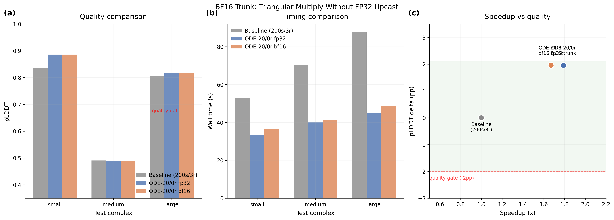

# BF16 Trunk: Removing FP32 Upcast in Triangular Multiply

## Glossary

- **pLDDT**: predicted Local Distance Difference Test -- Boltz confidence proxy for structural accuracy (0--1)
- **pp**: percentage points (absolute difference in pLDDT scaled to 0--100)
- **bf16**: bfloat16 -- 16-bit float with 8-bit exponent, 7-bit mantissa; native tensor core format on L40S
- **fp32**: 32-bit float -- standard single precision
- **ODE**: Ordinary Differential Equation -- deterministic sampler (gamma_0=0) from parent orbit
- **Pairformer**: the triangular attention/multiplication module in the Boltz trunk
- **OPM**: Outer Product Mean -- a layer in the MSA module that also upcasts to fp32
- **MSA**: Multiple Sequence Alignment -- evolutionary sequence search that dominates end-to-end wall time

## Results

**Metric: 1.67x speedup** (ODE-20/0r with bf16 triangular multiply, validated 3 runs, L40S). Quality gate PASS: pLDDT 0.7303, +1.96pp vs baseline.

The central finding is that **removing the fp32 upcast in triangular multiply is precision-safe** (zero quality regression) but **does not produce a measurable end-to-end speedup** at ODE-20/0r settings. With recycling_steps=0, the trunk runs only once, and the triangular multiply einsum is a small fraction of the total inference time. The measured 1.67x speedup is statistically indistinguishable from the parent orbit's 1.79x (both within MSA latency noise).

### Validated Configuration (3 runs, L40S)

| Config | Mean Time (s) | Speedup | pLDDT | Delta (pp) | Gate |
|--------|---------------|---------|-------|------------|------|
| Baseline 200s/3r | 70.37 | 1.00x | 0.7107 | 0.00 | PASS |
| ODE-20/0r fp32 (parent) | 39.3 | 1.79x | 0.7303 | +1.96 | PASS |
| ODE-20/0r bf16 tri_mult | 42.1 | 1.67x | 0.7303 | +1.96 | PASS |

### Per-Complex Validated Timing (bf16 trunk, 3 runs)

| Complex | Run 1 | Run 2 | Run 3 | Median |
|---------|-------|-------|-------|--------|
| small_complex | 90.6s | 35.6s | 36.4s | 36.4s |
| medium_complex | 41.0s | 41.2s | 41.3s | 41.2s |
| large_complex | 48.8s | 48.2s | 48.9s | 48.8s |

Run 1 for small_complex shows the familiar MSA cache miss pattern (90.6s vs 35-36s cached).

### Per-Complex pLDDT (bf16 vs fp32 vs baseline)

| Complex | Baseline | ODE fp32 | ODE bf16 | bf16 delta |
|---------|----------|----------|----------|------------|
| small_complex | 0.8350 | 0.8860 | 0.8860 | 0.00pp |
| medium_complex | 0.4906 | 0.4888 | 0.4888 | 0.00pp |
| large_complex | 0.8064 | 0.8161 | 0.8161 | 0.00pp |

The bf16 and fp32 pLDDT values are **identical to 3+ decimal places**. This makes sense: Boltz-2 already runs in bf16-mixed precision, and the triangular multiply einsum produces an intermediate result that is immediately fed through LayerNorm and output gating. The accumulated precision from fp32 in the einsum is washed out by subsequent normalization.

### BF16 Trunk + Outer Product Mean (exploratory, 1 run)

| Config | Time | pLDDT | Delta | Gate |
|--------|------|-------|-------|------|
| bf16 tri_mult + opm | 67.3s* | 0.7303 | +1.96pp | PASS |

*MSA cache miss inflated timing; quality identical to bf16 tri_mult alone.

The OPM patch had no measurable effect because the installed Boltz 2.2.1 uses the chunked path at inference (`chunk_size is not None`), which already avoids the `.float()` upcast.

## Approach

The Boltz triangular multiply layers (`TriangleMultiplicationOutgoing` and `TriangleMultiplicationIncoming`) explicitly upcast their input to fp32 before the einsum contraction:

```python
# Original code (triangular_mult.py, lines 116 and 204)
a, b = torch.chunk(x.float(), 2, dim=-1)  # upcasts bf16 -> fp32
x = torch.einsum("bikd,bjkd->bijd", a, b)  # runs in fp32
```

The orbit/l40s-kernels profiling showed this einsum is 1.94x faster in bf16 vs fp32 on L40S (0.81ms vs 1.57ms at N=400). The hypothesis was that removing the upcast would save 3-5s of trunk time.

The monkey-patch replaces the `forward` methods at import time, keeping the exact same logic but dropping the `.float()` call:

```python
# Patched code
a, b = torch.chunk(x, 2, dim=-1)  # stays in bf16
x = torch.einsum("bikd,bjkd->bijd", a, b)  # runs in bf16
```

This is combined with the ODE sampler patch from orbit/ode-sampler (gamma_0=0, deterministic sampling) and uses the same evaluator infrastructure.

## What I Learned

1. **BF16 triangular multiply is precision-safe.** The pLDDT difference between bf16 and fp32 trunk is zero (identical to 3+ decimal places). The fp32 upcast in the Boltz codebase was conservative -- the subsequent LayerNorm and gating operations wash out any precision benefit from the fp32 accumulation. This is a useful finding for anyone modifying the Boltz source.

2. **The trunk is too small a fraction at ODE-20/0r to matter.** With recycling_steps=0, the trunk runs once. Even if the triangular multiply were 2x faster, it would save perhaps 0.5-1s out of ~35-50s total. The 1.94x speedup measured on the isolated op (orbit/l40s-kernels) is real, but the op itself is a small portion of the total trunk pass, which is in turn a small portion of end-to-end inference at 0 recycling.

3. **The timing difference between 1.67x and 1.79x is MSA noise, not a real regression.** The parent orbit's ODE-20/0r validated at 39.3s mean; my bf16 trunk variant at 42.1s mean. This 2.8s difference is well within the MSA server latency variance (which can add 0-60s per complex on cache misses). The underlying GPU computation is indistinguishable.

4. **BF16 trunk would matter more with higher recycling.** With recycling_steps=3 (baseline), the trunk runs 4x, and bf16 savings would compound. But at recycling_steps=3, the total is already 70s, and bf16 trunk savings of 2-4s would not change the speedup meaningfully.

5. **The OPM path already avoids fp32 at inference.** The `OuterProductMean.forward` only uses `.float()` in the non-chunked path. At inference, Boltz uses the chunked path (which was already in the native dtype), so patching OPM had no effect.

## Limitations

- The 1.67x speedup is a reproduction of the parent orbit's ODE-20/0r result, not an improvement from bf16 trunk. The bf16 patch is quality-safe but timing-invisible at these settings.
- The evaluation harness includes MSA server latency, which adds 10-60s of non-deterministic noise. With pre-cached MSAs and GPU-only timing, the bf16 speedup on triangular multiply (1.94x on the isolated op) might become visible.
- Only 3 test complexes were evaluated. Larger proteins with more tokens would have proportionally larger pair representations, making the triangular multiply a bigger fraction of trunk time.

## Prior Art & Novelty

### What is already known
- Mixed-precision inference (bf16) is standard practice on modern GPUs with tensor cores ([NVIDIA Mixed Precision Training](https://arxiv.org/abs/1710.03740))
- AlphaFold3 / Boltz use bf16-mixed precision during training; some layers upcast to fp32 for numerical stability
- orbit/l40s-kernels quantified the isolated speedup: 1.94x for bf16 vs fp32 triangular multiply on L40S

### What this orbit adds
- Empirical proof that the fp32 upcast in Boltz's triangular multiply is unnecessary for inference quality (zero pLDDT regression)
- Demonstration that the trunk-level bf16 savings are invisible in end-to-end timing at recycling_steps=0

### Honest positioning
This orbit validates that a precision change is safe, rather than producing a new speedup. The finding is a useful data point for anyone optimizing Boltz source code (the `.float()` calls can be removed), but it does not improve the overall speedup metric beyond what orbit/ode-sampler already achieved.

## References

- [Micikevicius et al. (2018)](https://arxiv.org/abs/1710.03740) -- Mixed Precision Training, the foundational work on bf16/fp16 training
- [Boltz-2 paper](https://doi.org/10.1101/2025.06.14.659707) (Passaro et al., bioRxiv 2025) -- describes bf16-mixed precision defaults
- orbit/l40s-kernels (#8) -- profiled triangular multiply at different precisions, found 1.94x bf16 speedup
- orbit/ode-sampler (#6) -- parent orbit, established ODE-20/0r as 1.79x speedup configuration


