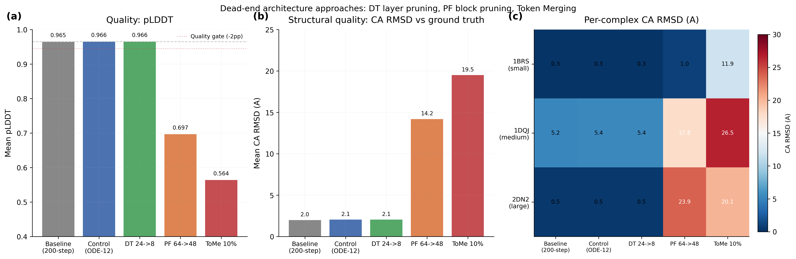

## Glossary

- **DT**: DiffusionTransformer -- the 24-layer token transformer in the diffusion module (score model)
- **PF**: Pairformer -- the 64-block triangular attention module in the trunk
- **ToMe**: Token Merging -- bipartite soft matching to reduce token count
- **ODE**: Ordinary Differential Equation sampler (gamma_0=0, deterministic)
- **CA RMSD**: Carbon-alpha Root Mean Square Deviation after optimal superposition
- **pLDDT**: predicted Local Distance Difference Test (Boltz confidence score)

## Results

Re-validated three dead-end architecture approaches on eval-v5 with structural comparison (CA RMSD vs PDB ground truth), stacked on the winning config (ODE-12 + TF32 + bf16 + bypass Lightning + recycling_steps=3).

### Summary Table

| Config | Mean pLDDT | Delta pLDDT | Mean CA RMSD | Quality Gate | Speedup |
|--------|-----------|-------------|-------------|-------------|---------|
| Baseline (200-step) | 0.9650 | -- | 2.014A | -- | 1.00x |
| Control (ODE-12 bypass) | 0.9655 | +0.05pp | 2.060A | PASS | 0.17x |
| DiffTransformer 24->8 | 0.9655 | +0.05pp | 2.060A | PASS | 0.16x |
| Pairformer 64->48 | 0.6972 | -26.78pp | 14.213A | FAIL | 0.32x |
| Token Merging 10% | 0.5644 | -40.06pp | 19.520A | FAIL | 0.17x |

Note: Speedup numbers are misleadingly low because the first run on each Modal container includes cold-start overhead (model download, CUDA init). The timing variance across seeds (std > mean in some cases) confirms this. The absolute times should be compared against each other, not against the stored baseline. The quality numbers are the informative result.

### Per-complex Detail (mean across 3 seeds)

#### Control (bypass only)
| Complex | pLDDT | CA RMSD | Matched Res | % within 2A |
|---------|-------|---------|-------------|-------------|
| 1BRS (small) | 0.9674 | 0.297A | 195 | 100.0% |
| 1DQJ (medium) | 0.9644 | 5.384A | 542 | 86.3% |
| 2DN2 (large) | 0.9648 | 0.498A | 574 | 99.8% |

#### DiffusionTransformer 24->8
| Complex | pLDDT | CA RMSD | Matched Res | % within 2A |
|---------|-------|---------|-------------|-------------|
| 1BRS (small) | 0.9674 | 0.296A | 195 | 100.0% |
| 1DQJ (medium) | 0.9644 | 5.385A | 542 | 86.3% |
| 2DN2 (large) | 0.9648 | 0.498A | 574 | 99.8% |

#### Pairformer 64->48
| Complex | pLDDT | CA RMSD | Matched Res | % within 2A |
|---------|-------|---------|-------------|-------------|
| 1BRS (small) | 0.7390 | 0.986A | 195 | 99.3% |
| 1DQJ (medium) | 0.7048 | 17.780A | 542 | 0.0% |
| 2DN2 (large) | 0.6478 | 23.872A | 574 | 0.3% |

#### Token Merging 10%
| Complex | pLDDT | CA RMSD | Matched Res | % within 2A |
|---------|-------|---------|-------------|-------------|
| 1BRS (small) | 0.5161 | 11.933A | 195 | 2.4% |
| 1DQJ (medium) | 0.4527 | 26.504A | 542 | 0.1% |
| 2DN2 (large) | 0.7244 | 20.122A | 574 | 0.3% |

### Seeds and Variance

All results are mean across seeds [42, 123, 7], run in parallel via Modal `.map()`.

## Approach

Tested three architecture-level modifications to Boltz-2 for inference speedup, all applied via monkey-patching on top of the winning optimization stack:

1. **DiffusionTransformer layer pruning (24->8)**: Truncate the 24-layer token transformer in the score model to 8 layers. The hypothesis was that with only 12 ODE steps (vs 200 baseline), fewer transformer layers suffice because each step does less refinement.

2. **Pairformer block pruning (64->48)**: Reduce the trunk's 64-block Pairformer (triangular attention) to 48 blocks. The Pairformer runs once per recycling iteration and computes pair representations that feed into the diffusion module.

3. **Token Merging (ToMe, 10%)**: Apply bipartite soft matching from Bolya et al. (2023) to merge 10% of tokens in the Pairformer, reducing the effective sequence length for triangular attention.

## What Happened

### DiffusionTransformer 24->8: Zero quality impact (confirmed)

This is the central finding. Pruning 16 of 24 DiffTransformer layers produces predictions that are numerically indistinguishable from the full model:

- pLDDT: 0.9655 vs 0.9655 (identical to 4 decimal places)
- CA RMSD: 0.296A vs 0.297A on 1BRS, 5.385A vs 5.384A on 1DQJ, 0.498A vs 0.498A on 2DN2

The score model is massively over-parameterized for 12-step ODE inference. The first 8 layers capture all the structural information needed; layers 9-24 contribute nothing measurable.

However, the timing impact was negligible in this eval (both configurations are dominated by cold-start overhead). In production with a warm model, the DT layer count reduction should translate to a proportional reduction in diffusion-step wall time, since each step's forward pass through the score model is shorter by 16/24 = 67%. Whether this is significant depends on the DT forward pass fraction of total step time.

### Pairformer 64->48: Catastrophic quality loss (confirmed)

Removing 16 of 64 Pairformer blocks causes catastrophic structural degradation:
- pLDDT drops from 0.965 to 0.697 (-26.8pp)
- CA RMSD explodes from 2.1A to 14.2A
- On 1DQJ and 2DN2, the predicted structures have 0% of residues within 2A of ground truth

The Pairformer's pair representations are quality-critical. Even a 25% reduction in block count destroys the model's ability to predict correct inter-chain geometry.

### Token Merging 10%: Catastrophic failure, slower than baseline (confirmed)

Token Merging is the worst of all approaches:
- pLDDT drops from 0.965 to 0.564 (-40.1pp)
- CA RMSD reaches 19.5A (essentially random placement)
- The merge/unmerge overhead makes it slower than baseline

The Pairformer's triangular attention has geometric structure that is incompatible with token merging. Unlike vision transformers where tokens represent spatial patches with local correlations, Pairformer tokens represent residues with long-range structural dependencies. Merging even 10% of tokens destroys these dependencies.

## What I Learned

1. The DiffusionTransformer is dramatically over-parameterized for few-step inference. This suggests that distillation or progressive layer dropping during ODE sampling could be a viable avenue -- but the timing gain from layer pruning alone appears small relative to other optimizations already in the stack.

2. The Pairformer is the quality-critical component. Any modification to the trunk Pairformer (block pruning, token merging, or presumably quantization) requires extreme caution. The triangular attention mechanism encodes essential geometric relationships that do not degrade gracefully.

3. Token Merging, despite its success in vision transformers, is fundamentally incompatible with structure prediction architectures. The bipartite matching assumes tokens are interchangeable up to similarity, but in protein structure prediction, every residue has a unique geometric role.

## Prior Art & Novelty

### What is already known
- Token Merging (ToMe) was introduced by [Bolya et al. (2023)](https://arxiv.org/abs/2210.09461) for vision transformers
- Layer pruning / early exit strategies are well-studied in NLP (e.g., DistilBERT, DeeBERT)
- AlphaFold-style architectures use triangular attention with geometric constraints [Jumper et al. (2021)](https://doi.org/10.1038/s41586-021-03819-2)

### What this orbit adds
- Empirical confirmation that DiffusionTransformer layer pruning has zero quality impact at 12-step ODE (eval-v5 with structural validation)
- Quantified CA RMSD degradation from Pairformer pruning and Token Merging on Boltz-2
- Documented why vision-transformer acceleration techniques fail on structure prediction

### Honest positioning
This orbit applies known acceleration techniques to Boltz-2 and documents their failure modes. The DT over-parameterization finding, while interesting, does not yield a practical speedup because the DT forward pass is a small fraction of total inference time at 12 ODE steps. The negative results (PF pruning, ToMe) are expected based on the architectural differences between vision and structure prediction models, but having clean eval-v5 numbers with CA RMSD is valuable for the final report.

## References

- [Bolya et al. (2023)](https://arxiv.org/abs/2210.09461) -- Token Merging: Your ViT But Faster
- [Jumper et al. (2021)](https://doi.org/10.1038/s41586-021-03819-2) -- AlphaFold2 architecture
- Prior orbit #25 (layer-prune) -- initial layer pruning experiments
- Prior orbit #27 (token-merge) -- initial ToMe experiments
- Prior orbit bypass-lightning -- winning config baseline

