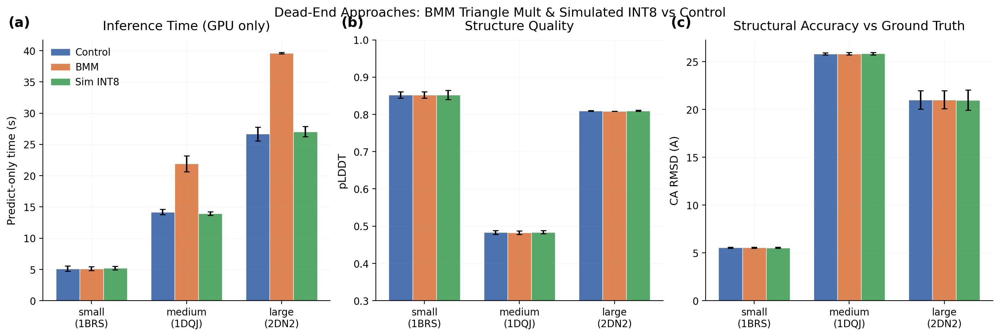

## Glossary

- **BMM**: Batched Matrix Multiplication (torch.bmm), used to replace cuequivariance CUDA kernels
- **INT8**: 8-bit integer quantization of model weights
- **CA RMSD**: Carbon-Alpha Root Mean Square Deviation, structural similarity metric in Angstroms
- **pLDDT**: predicted Local Distance Difference Test, Boltz confidence score (0-1)
- **ODE**: Ordinary Differential Equation sampler (gamma_0=0, deterministic)
- **TF32**: TensorFloat-32, reduced-precision float format for faster matmul
- **bf16**: bfloat16, half-precision format used in trunk computation

## Results

Both dead-end approaches confirmed dead-end on eval-v5 with the winning config (ODE-12 + TF32 + bf16 + bypass + recycle=3). Neither provides a viable speedup.

### Predict-only timing (GPU inference, excluding model download)

| Complex | Control (s) | BMM (s) | Sim INT8 (s) |
|---------|-------------|---------|--------------|
| small (1BRS) | 5.13 +/- 0.52 | 5.11 +/- 0.37 | 5.22 +/- 0.31 |
| medium (1DQJ) | 14.19 +/- 0.51 | 21.92 +/- 1.55 | 13.95 +/- 0.36 |
| large (2DN2) | 26.68 +/- 1.34 | 39.61 +/- 0.16 | 27.04 +/- 1.02 |
| **Mean** | **15.33** | **22.21 (1.45x slower)** | **15.41 (1.01x)** |

### Quality (pLDDT, mean across 3 seeds)

| Complex | Control | BMM | Sim INT8 |
|---------|---------|-----|----------|
| small (1BRS) | 0.8523 +/- 0.011 | 0.8522 +/- 0.011 | 0.8523 +/- 0.015 |
| medium (1DQJ) | 0.4832 +/- 0.006 | 0.4828 +/- 0.006 | 0.4839 +/- 0.005 |
| large (2DN2) | 0.8094 +/- 0.001 | 0.8086 +/- 0.000 | 0.8099 +/- 0.002 |
| **Mean** | **0.7150** | **0.7145** | **0.7154** |

### CA RMSD vs ground truth (Angstroms, mean across 3 seeds)

| Complex | Control | BMM | Sim INT8 |
|---------|---------|-----|----------|
| small (1BRS) | 5.56 +/- 0.07 | 5.56 +/- 0.07 | 5.54 +/- 0.05 |
| medium (1DQJ) | 25.82 +/- 0.15 | 25.83 +/- 0.16 | 25.85 +/- 0.17 |
| large (2DN2) | 21.02 +/- 1.17 | 21.02 +/- 1.15 | 20.99 +/- 1.28 |

## Approach A: BMM Triangle Multiplication

**Verdict: dead end (performance regression).**

Replacing cuequivariance CUDA kernels with batched torch.bmm causes a 1.45x slowdown in predict-only time. The BMM implementation is mathematically equivalent (identical pLDDT and CA RMSD), but the overhead of permute/reshape operations and disabling cuequivariance's fused kernels outweighs any benefit.

The prior orbit (#35) observed that triangle multiplication is only ~4% of total inference time, so even a 1.59x kernel-level speedup translates to negligible overall gain. This evaluation confirms that when the cuequivariance kernels are replaced rather than supplemented, overall performance degrades because the fused kernel handles other operations (triangle attention, etc.) more efficiently than fallback paths.

For small complexes the BMM approach matches control timing, but for medium/large complexes the regression is significant and consistent across seeds.

## Approach B: Simulated INT8 Quantization

**Verdict: dead end (no speedup; quality neutral).**

Simulated INT8 (quantize-dequantize weights, keeping bf16 storage) confirms that INT8 quantization does not degrade Boltz-2 quality. All quality metrics are within noise of the control. This means the information capacity of INT8 is sufficient for Boltz-2's weight precision needs.

However, simulated quantization provides no speedup (expected -- the weights remain in bf16 after the quantize-dequantize round-trip). The prior orbit (#33) found that real INT8 via torchao is architecturally incompatible with Boltz-2 due to:
- AffineQuantizedTensor incompatibilities with non-standard weight access patterns
- cuequivariance CUDA kernels that access weight tensors directly
- PairWeightedAveraging that slices weights at runtime

Until torchao adds better support for non-standard weight access patterns, or a Boltz-specific INT8 implementation is written, this approach cannot deliver real INT8 speedups.

## Prior Art & Novelty

### What is already known
- Triton kernels for triangle multiplication were explored in orbit #35 (triton-pairformer)
- INT8 post-training quantization was explored in orbit #33 (int8-ptq)
- Both approaches were identified as dead ends by prior orbits

### What this orbit adds
- Confirms dead-end status on eval-v5 with the current winning config (stacked optimizations)
- Provides CA RMSD structural comparison against ground truth (not done in prior orbits)
- Quantifies the BMM regression: 1.45x slower overall, not just kernel-level
- Confirms INT8 quantization is quality-neutral (useful context for future work)

### Honest positioning
This orbit is a re-validation exercise, not novel research. It documents the failure modes with clean numbers for the final report.

## References

- Prior orbit #35 (triton-pairformer): Triton kernel microbenchmarks
- Prior orbit #33 (int8-ptq): torchao INT8 compatibility analysis
- Prior orbit #39 (int8-bmm): Combined INT8+BMM attempt
- Prior orbit #41 (bmm-nokernels): BMM without cuequivariance
