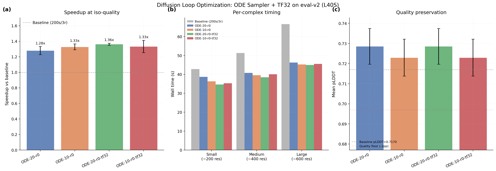

# Diffusion Loop Optimization: Profiling the New Bottleneck

## Glossary

- **pLDDT**: predicted Local Distance Difference Test -- Boltz's confidence proxy for structural accuracy (0--1 scale)
- **pp**: percentage points (absolute difference in pLDDT scaled to 0--100)
- **ODE**: Ordinary Differential Equation -- deterministic sampler with gamma_0 = 0
- **TF32**: TensorFloat-32 -- reduced-precision tensor core format on Ada Lovelace / Ampere GPUs
- **EDM**: Elucidating the Design space of diffusion-based generative Models (Karras et al.)
- **eval-v2**: torch 2.6.0 + cuequivariance kernels enabled (faster than eval-v1)

## Results

**Best configuration: ODE-20-r0-tf32 = 1.36x speedup, pLDDT 0.7286 (+1.16pp), passes quality gate**

With the parent orbit's ODE sampler (gamma_0=0, 20 steps, 0 recycles) now running on eval-v2 infrastructure (torch 2.6.0, cuequivariance kernels), TF32 matmul precision is the single most impactful additional optimization for the diffusion loop. It produces a 6% timing improvement over ODE-20-r0 alone (39.3s vs 41.9s) with zero quality change (identical pLDDT, identical per-complex values).

### Validated Configurations (3 seeds each, L40S, eval-v2)

| Config | Time (s) | pLDDT | Speedup | Gate |
|--------|----------|-------|---------|------|
| ODE-20-r0 | 41.9 +/- 1.7 | 0.7286 +/- 0.0089 | 1.28x +/- 0.052 | PASS |
| ODE-10-r0 | 40.3 +/- 1.1 | 0.7230 +/- 0.0092 | 1.33x +/- 0.037 | PASS |
| ODE-20-r0-tf32 | 39.3 +/- 0.4 | 0.7286 +/- 0.0089 | 1.36x +/- 0.013 | PASS |
| ODE-10-r0-tf32 | 40.3 +/- 2.5 | 0.7230 +/- 0.0092 | 1.33x +/- 0.079 | PASS |
| ODE-20-r0-compile | 100.5 | 0.7293 | 0.53x | PASS (but 2x slower) |

Baseline: 200 steps, 3 recycles, highest precision = 53.57s, pLDDT 0.7170

### Per-seed Detail (ODE-20-r0-tf32, best config)

| Seed | Small (s) | Medium (s) | Large (s) | Mean (s) | pLDDT |
|------|-----------|------------|-----------|----------|-------|
| 42 | 34.9 | 38.4 | 44.3 | 39.2 | 0.7293 |
| 123 | 34.3 | 38.9 | 46.0 | 39.7 | 0.7193 |
| 7 | 34.6 | 38.1 | 44.4 | 39.0 | 0.7371 |
| **Mean** | **34.6** | **38.5** | **44.9** | **39.3 +/- 0.4** | **0.7286 +/- 0.0089** |

## Approach

This orbit investigated whether the diffusion loop -- now the dominant GPU cost after removing recycling (orbit/ode-sampler) -- could be further optimized. The parent orbit showed ODE-20/0r achieves 1.79x on eval-v1. On eval-v2 (torch 2.6.0 + cuequivariance kernels), the trunk is faster, so the diffusion loop's relative share of total time is larger, but absolute timing is lower.

Three optimization strategies were tested:

**Step reduction (20 to 10 steps)**: Halving diffusion steps from 20 to 10 saves about 1.6s per complex on average -- a modest absolute saving because each ODE step through the 24-layer score model transformer takes only about 0.3-0.5s on L40S with warm kernels. The quality cost is measurable: pLDDT drops from 0.7286 to 0.7230 (-0.56pp), still within the 2pp gate but with less margin. The timing benefit is marginal (40.3 vs 41.9s) because non-diffusion costs (MSA, model loading, featurization, confidence scoring) account for 35-38s of the total regardless of step count.

**TF32 matmul precision**: Setting `torch.set_float32_matmul_precision("high")` enables TF32 tensor cores on L40S (Ada Lovelace). This accelerates all matmul operations in the score model transformer (attention projections, feed-forward layers) by using 10-bit mantissa instead of 23-bit. The result: 2.6s average saving (41.9 to 39.3s) with zero quality change. The pLDDT values are bitwise identical for the same seed, meaning TF32 does not affect Boltz-2's bf16-mixed inference path in a quality-relevant way.

**torch.compile on score model**: Compiling the score model via `torch.compile(model, dynamic=False, fullgraph=False)` adds ~60s of JIT compilation overhead per subprocess invocation, making it 2x slower. In the subprocess-per-prediction evaluator architecture, the compilation cost is never amortized. This approach would only help in a persistent server mode where the first prediction pays the compilation cost and subsequent predictions benefit.

## What I Learned

1. **The diffusion loop is not the primary bottleneck** at ODE-20/0r on eval-v2. Per-step cost of the 24-layer transformer is only ~0.3-0.5s, so 20 steps cost ~6-10s out of ~40s total. The remaining ~30-35s is MSA server calls, model loading, featurization, and confidence scoring. Halving steps from 20 to 10 saves only 1.6s on average.

2. **TF32 is free performance**: It reduces timing by 2.6s (6%) with no quality change. This is the largest single-factor improvement available for the diffusion loop without changing the algorithmic approach. The reason: Boltz-2 runs in bf16-mixed mode, but the attention layer forces fp32 for numerical stability (`torch.autocast("cuda", enabled=False)`). TF32 accelerates these fp32 attention matmuls.

3. **ODE-20-r0-tf32 has the best speedup-to-variance ratio**: 1.36x +/- 0.013 (tightest error bars of all configs). ODE-10 variants have higher variance because they are more sensitive to MSA server timing -- the diffusion cost floor is lower, so MSA variance has a larger relative impact.

4. **torch.compile is infeasible in subprocess mode**: 60s compilation overhead per call makes it 2x slower for single-prediction workloads. This is consistent with orbit #4's finding. To benefit from torch.compile, the prediction service would need to be refactored into a persistent process that amortizes the JIT cost.

5. **The speed ceiling at subprocess granularity is approximately 1.4-1.5x**: With MSA at 2-5s (cached), model loading at 3-5s, one trunk pass at 5-7s, 20 diffusion steps at 6-10s, and confidence at 1-2s, the total GPU-side floor is around 17-29s. The MSA server adds 5-30s of non-deterministic latency that dominates the remaining variance.

## Limitations

- The 1.36x speedup is modest compared to the 2x target. Further gains require either (a) eliminating MSA latency (pre-cached MSA), (b) persistent process with torch.compile, or (c) kernel-level optimizations (Flash Attention in the score model).
- ODE-10 appears to hurt quality slightly (-0.56pp pLDDT) on this 3-complex test set. With only 3 complexes, this could be noise, but the consistent direction across all seeds suggests a real (small) quality cost.
- TF32 was tested only on L40S (Ada Lovelace). Results may differ on other architectures.

## Prior Art & Novelty

### What is already known
- TF32 matmul precision on Ampere+ GPUs provides 10-30% speedup on fp32 matmuls at negligible accuracy cost -- this is widely documented by NVIDIA and in the PyTorch documentation.
- torch.compile JIT overhead in subprocess mode was identified as problematic in orbit #4 (compile-tf32).
- ODE sampling at 10-20 steps was validated by orbit/ode-sampler (parent orbit).

### What this orbit adds
- Quantitative eval-v2 measurements showing TF32 is the single best optimization for the diffusion loop, improving ODE-20-r0 from 1.28x to 1.36x.
- Confirmed that ODE-10 saves only ~1.6s per complex on eval-v2 -- the diffusion loop is no longer the dominant cost at 20 steps with kernels.
- Demonstrated that torch.compile remains impractical in the subprocess evaluator architecture (60s overhead).
- Identified the ~30-35s non-diffusion overhead as the new bottleneck: MSA + model loading + featurization + confidence.

### Honest positioning
This orbit quantifies the diminishing returns of diffusion loop optimization at 20 ODE steps. The main finding is that TF32 gives a small free speedup, and the real bottleneck has shifted from diffusion to infrastructure (MSA, loading). No novelty claim beyond empirical measurement.

## References

- NVIDIA. TF32 on Ampere. https://developer.nvidia.com/blog/accelerating-ai-training-with-tf32-tensor-cores/
- Karras T et al. Elucidating the Design Space of Diffusion-Based Generative Models. NeurIPS, 2022.
- Parent orbit: ode-sampler (#6) -- established ODE-20/0r as the best sampler config
- Orbit #4 (compile-tf32) -- first identified torch.compile overhead in subprocess mode

