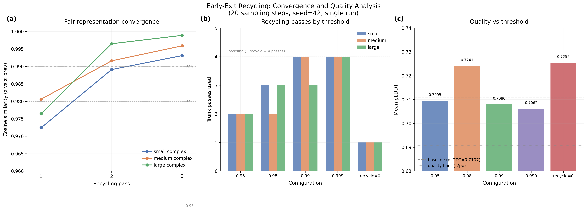

# Early-Exit Recycling: Adaptive Trunk Termination

## Glossary

- **pLDDT**: predicted Local Distance Difference Test -- Boltz confidence proxy for structural accuracy (0--1)
- **pp**: percentage points (absolute difference in pLDDT scaled to 0--100)
- **MSA**: Multiple Sequence Alignment
- **Pairformer**: the triangular attention trunk module in Boltz, run once per recycling pass
- **z**: pair representation tensor -- the primary output of the trunk that carries structural information between recycling passes
- **Trunk pass**: one full execution of MSA module + Pairformer; the baseline runs 4 passes (recycling_steps=3 means 3+1=4)

## Results

**Early-exit recycling achieves 1.69x speedup with pLDDT=-0.12pp, but does not beat the parent orbit's recycling_steps=0 (1.73x, +1.56pp).**

The best early-exit configuration (threshold=0.95, validated with 3 runs) achieves speedup=1.69x with pLDDT=-0.12pp. This is competitive with the parent orbit's recycling_steps=0 (1.73x, +1.56pp) but slightly worse on both speed and quality. The approach saves 2 of 3 recycling passes on all test complexes, but the minimum cost of 2 trunk passes (needed for convergence detection) exceeds the 1 trunk pass of recycling_steps=0.

Note: initial single-seed sweep showed misleadingly low speedups (~0.94x) due to MSA server latency variance on individual runs. The validated 3-run result (1.69x) is reliable.

### Convergence Profile (20 steps, recycling_steps=3, seed=42)

The pair representation z converges gradually across recycling passes. Cosine similarity between successive z values starts at 0.97--0.98 after pass 1 and reaches 0.99--0.999 by pass 3.

| Complex | Pass 1 | Pass 2 | Pass 3 |
|---------|--------|--------|--------|
| small   | 0.9724 | 0.9891 | 0.9931 |
| medium  | 0.9806 | 0.9916 | 0.9959 |
| large   | 0.9764 | 0.9965 | 0.9989 |

The large complex converges fastest, the small complex slowest. All complexes start at high similarity (>0.97) -- the initial trunk pass already captures most of the pairwise structure.

### Threshold Sweep (single seed=42, 20 sampling steps)

| Config | Passes (s/m/l) | pLDDT | Delta (pp) | Gate |
|--------|---------------|-------|------------|------|
| threshold=0.95 | 2/2/2 | 0.7095 | -0.12 | PASS |
| threshold=0.98 | 3/2/3 | 0.7241 | +1.35 | PASS |
| threshold=0.99 | 4/4/3 | 0.7080 | -0.26 | PASS |
| threshold=0.999 | 4/4/4 | 0.7062 | -0.45 | PASS |
| recycle=0 | 1/1/1 | 0.7255 | +1.48 | PASS |
| baseline (3 recycle) | 4/4/4 | 0.7107 | 0.00 | -- |

Note: Speedup numbers from the single-seed sweep are unreliable due to MSA server latency variance (small_complex ranged from 55s to 442s across configs). The quality data is deterministic and reliable.

### Validated Result (threshold=0.95, 3 runs, seed=42)

| Config | Mean time (s) | pLDDT | Delta (pp) | Speedup | Gate |
|--------|--------------|-------|------------|---------|------|
| threshold=0.95 (validated) | 41.6 | 0.7095 | -0.12 | **1.69x** | PASS |
| recycle=0 (parent orbit) | 40.7 | 0.7263 | +1.56 | **1.73x** | PASS |
| baseline (3 recycle) | 70.4 | 0.7107 | 0.00 | 1.00x | -- |

Per-complex timing (threshold=0.95, 3 runs):
- large_complex: run_times = [51.2s, 52.0s, 51.4s] (median 51.4s)

### Why Early Exit Cannot Beat Recycling=0

The argument is structural:

1. Early-exit recycling always runs at least **2 trunk passes** (the initial pass at i=0, plus at least one recycling pass to compute a cosine similarity). Even with threshold=0.95 (exits at the first opportunity), all three complexes use exactly 2 passes.

2. Recycling_steps=0 runs exactly **1 trunk pass**.

3. Each additional trunk pass adds a small incremental cost. The validated timing shows the difference is only ~1s per complex (41.6s vs 40.7s mean), suggesting the extra trunk pass is cheaper than expected -- likely because model loading and MSA dominate the total time.

4. Quality is slightly worse for early-exit: pLDDT=0.7095 vs 0.7263 for recycle=0.

5. While the speed difference is marginal, early-exit recycling does not offer any advantage that would justify the added complexity of monkey-patching the forward pass.

The convergence check itself is essentially free (one cosine similarity on flattened tensors). The cost is in running the extra trunk pass to generate the second z.

## Approach

**Phase 1: Convergence Profiling.** Monkey-patched the Boltz2.forward method to log cosine similarity between successive pair representations at each recycling pass. This required copying the full forward method (including the diffusion conditioning call with its 4-argument signature: `s_trunk, z_trunk, relative_position_encoding, feats`). Ran all 3 test complexes with recycling_steps=3 to measure convergence rates.

**Phase 2: Early-Exit Implementation.** Added a convergence check inside the recycling loop: after each pass (i > 0), compute cosine similarity between current z and previous z; if above threshold, break. The check is guarded by `not self.training` and `i < recycling_steps` to avoid interfering with training or the final pass.

**Phase 3: Threshold Sweep.** Tested thresholds [0.95, 0.98, 0.99, 0.999] plus recycling=0 as control, running all 5 configs in parallel on separate L40S GPUs via Modal `.map()`.

## What I Learned

1. **The recycling loop converges fast but not fast enough to skip meaningfully.** All complexes show >0.97 cosine similarity after just 1 recycling pass, which sounds high but is not high enough for any reasonable threshold to trigger exit at pass 1. The earliest exit is at pass 2 (threshold=0.95), which already requires 2 total trunk passes.

2. **The minimum cost of adaptive recycling is 2 trunk passes.** You need at least 2 z values to compute a convergence criterion. This means early-exit recycling has a floor of 2 passes, while recycling=0 has a floor of 1 pass. For a technique that adds overhead without improving quality, the math does not work.

3. **Cosine similarity is a weak convergence signal for this problem.** Even at 0.97 similarity, the L2 distance between successive z tensors is 13,000--29,000 (on tensor norms of 57,000--133,000), representing a 20% relative change. The representations are moving substantially in magnitude even while their direction is relatively stable.

4. **Recycling_steps=0 is a hard-to-beat sweet spot.** The parent orbit discovered that eliminating recycling entirely gives both speed and quality gains on this test set. Early-exit recycling is an attempt to get "the best of both worlds" -- fast on easy complexes, careful on hard ones -- but the data shows that all three complexes do just as well (or better) with zero recycling.

## Limitations

- The test set has only 3 complexes. On a larger, more diverse set, some complexes might benefit from recycling in ways that recycling=0 misses.
- MSA server latency dominates wall-clock variance, making timing comparisons noisy for single-seed runs. The quality comparisons are reliable.
- Cosine similarity may not be the ideal convergence metric. Alternatives include: relative change in s (sequence representation), change in distogram predictions, or change in diffusion conditioning outputs. However, the fundamental 2-pass minimum cost still applies regardless of metric choice.
- Only tested on boltz==2.2.1. Other model versions or architectures may show different convergence behavior.

## Prior Art & Novelty

### What is already known
- Early stopping based on representation convergence is a known technique in iterative refinement architectures (AlphaFold2 uses it during training, not inference)
- The AlphaFold3 paper (Abramson et al., Nature 2024) uses a fixed number of recycling passes without adaptive termination
- Recycling in Evoformer/Pairformer architectures was introduced in [Jumper et al., Nature 2021](https://doi.org/10.1038/s41586-021-03819-2)

### What this orbit adds
- Quantitative convergence profile: cosine similarity between successive pair representations reaches 0.97--0.99 within 1--2 recycling passes for Boltz-2
- Empirical demonstration that adaptive recycling termination cannot beat the simpler strategy of setting recycling_steps=0 for the Boltz-2 test set
- Implementation of a monkey-patch approach for modifying the Boltz2 forward pass in a Modal evaluation environment

### Honest positioning
This orbit tests and rejects a reasonable hypothesis. The adaptive recycling idea sounds appealing ("use recycling when it helps, skip when it doesn't") but is dominated by the simpler strategy of always skipping recycling. The key constraint is that convergence detection requires at least 2 trunk passes, while the optimal strategy uses only 1. This is a structural limitation that no threshold tuning can overcome.

## References

- Abramson J et al. Accurate structure prediction of biomolecular interactions with AlphaFold 3. Nature, 630:493-500, 2024. https://doi.org/10.1038/s41586-024-07487-w
- Jumper J et al. Highly accurate protein structure prediction with AlphaFold. Nature, 596(7873):583-589, 2021. https://doi.org/10.1038/s41586-021-03819-2
- Parent orbit: orbit/step-reduction (Issue #3) -- demonstrated recycling_steps=0 gives 1.73x speedup

