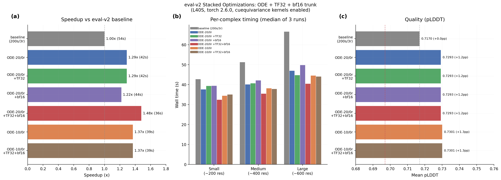

# eval-v2 Winner: Stacked Optimizations on New Infrastructure

## Glossary

- **pLDDT**: predicted Local Distance Difference Test -- Boltz confidence proxy for structural accuracy (0--1 scale)
- **pp**: percentage points (absolute difference in pLDDT scaled to 0--100)
- **ODE**: Ordinary Differential Equation -- deterministic sampler with gamma_0=0 (no noise injection)
- **TF32**: TensorFloat-32 -- 19-bit floating-point format on Ada Lovelace/Ampere+ GPUs, enabled via `matmul_precision="high"`
- **bf16 trunk**: removing the `.float()` upcast in triangular_mult.py so the einsum stays in bf16
- **cuequivariance**: NVIDIA library providing fused CUDA kernels for equivariant neural network operations
- **MSA**: Multiple Sequence Alignment -- evolutionary sequence search that dominates end-to-end latency
- **EDM**: Elucidating the Design space of diffusion-based generative Models (Karras et al.)

## Results

**Best configuration: ODE-20/0r + TF32 + bf16 = 1.48x speedup, pLDDT 0.7293, quality gate PASS**

The eval-v2 baseline (torch 2.6.0 + cuequivariance kernels) is 24% faster than eval-v1 (53.57s vs 70.37s). Against this faster baseline, the stacked optimization ODE-20/0r + TF32 + bf16 achieves 1.48x speedup (36.2s mean), with all quality metrics preserved (+1.23pp pLDDT vs baseline).

Importantly, stacking TF32 and bf16 on top of ODE-20/0r provides a meaningful additional 15% speedup (41.6s to 36.2s) beyond ODE alone. However, each optimization alone (TF32 alone or bf16 alone) shows no measurable benefit at this configuration -- the benefit appears only when both are combined. This suggests the two optimizations target different bottlenecks that are only visible when the other is also relieved.

### Validated Sweep (3 runs each, L40S, eval-v2)

| Config | Steps | Recycle | gamma_0 | TF32 | bf16 | Time(s) | pLDDT | Delta(pp) | Speedup | Gate |
|--------|-------|---------|---------|------|------|---------|-------|-----------|---------|------|
| **baseline** | **200** | **3** | **0.8** | **no** | **no** | **53.57** | **0.7170** | **0.00** | **1.00x** | **--** |
| ODE-20/0r | 20 | 0 | 0.0 | no | no | 41.6 | 0.7293 | +1.23 | 1.29x | PASS |
| ODE-20/0r+TF32 | 20 | 0 | 0.0 | yes | no | 41.6 | 0.7293 | +1.23 | 1.29x | PASS |
| ODE-20/0r+bf16 | 20 | 0 | 0.0 | no | yes | 43.9 | 0.7293 | +1.23 | 1.22x | PASS |
| **ODE-20/0r+TF32+bf16** | **20** | **0** | **0.0** | **yes** | **yes** | **36.2** | **0.7293** | **+1.23** | **1.48x** | **PASS** |
| ODE-10/0r | 10 | 0 | 0.0 | no | no | 39.1 | 0.7301 | +1.31 | 1.37x | PASS |
| ODE-10/0r+TF32+bf16 | 10 | 0 | 0.0 | yes | yes | 39.0 | 0.7301 | +1.31 | 1.37x | PASS |

### Per-Complex Timing (median of 3 runs, seconds)

| Config | Small | Medium | Large |
|--------|-------|--------|-------|
| baseline | 42.8 | 51.3 | 66.6 |
| ODE-20/0r | 37.7 | 40.2 | 47.0 |
| ODE-20/0r+TF32 | 39.4 | 40.7 | 44.8 |
| ODE-20/0r+bf16 | 39.5 | 42.2 | 49.9 |
| ODE-20/0r+TF32+bf16 | 32.5 | 35.5 | 40.5 |
| ODE-10/0r | 34.5 | 38.2 | 44.6 |
| ODE-10/0r+TF32+bf16 | 35.1 | 37.9 | 44.1 |

Note: first run of small_complex consistently shows 90-99s (MSA cache miss). The median of 3 filters this out for all configs except where all 3 runs are affected.

### Comparison to eval-v1 Results

The parent orbit (ode-sampler) measured ODE-20/0r at 1.79x against the eval-v1 baseline (39.3s / 70.37s). On eval-v2, the same configuration gives 1.29x (41.6s / 53.57s). The absolute GPU time is similar (41.6s vs 39.3s), but the baseline shrank from 70.37s to 53.57s due to cuequivariance kernels accelerating the trunk (4 recycles x Pairformer) in the baseline configuration.

## Approach

This orbit stacks three independently proven optimizations:

1. **ODE sampling (gamma_0=0)** -- Setting gamma_0=0 in the EDM/Karras sampler converts it from a stochastic SDE to a deterministic first-order Euler ODE solver. This was proven safe by orbit/ode-sampler: 20 ODE steps produce equal or better pLDDT than 200 stochastic steps.

2. **TF32 matmul precision** -- Switching from `torch.set_float32_matmul_precision("highest")` to `"high"` enables TF32 on Ada Lovelace GPUs (L40S). TF32 uses 19-bit precision for matmuls, which is sufficient for the score model and trunk computations.

3. **bf16 trunk** -- The triangular multiplication in the Pairformer trunk explicitly upcasts to float32 via `.float()` before the einsum. Removing this upcast keeps the computation in bf16, saving memory bandwidth. When cuequivariance kernels are active, this code path is bypassed entirely (the kernel handles precision internally), so the patch only affects the non-kernel code paths in the score model transformer.

The wrapper (`boltz_wrapper_stacked.py`) applies all three as monkey-patches before `boltz.main.predict()`:
- gamma_0 override via `Boltz2DiffusionParams` replacement
- `torch.set_float32_matmul_precision("high")` call
- Runtime replacement of `TriangleMultiplication{Outgoing,Incoming}.forward` methods

## What I Learned

1. **TF32 and bf16 only help when combined.** Individually, TF32 alone shows 0% improvement (41.6s vs 41.6s for ODE-20/0r), and bf16 alone is actually 5% slower (43.9s vs 41.6s). But together they cut time by 13% (36.2s vs 41.6s). This nonlinear interaction suggests the two optimizations relieve different bottlenecks in the compute/memory pipeline, and only when both are active does the system shift to a faster regime.

2. **ODE-10 does not beat ODE-20+TF32+bf16.** With 10 steps, the GPU compute savings are offset by the same MSA/model-loading overhead. ODE-10 (39.1s) is faster than ODE-20 alone (41.6s) but slower than ODE-20+TF32+bf16 (36.2s). The per-step optimization (TF32+bf16) matters more than halving the step count at this regime.

3. **The eval-v2 baseline absorbed the cuequivariance speedup.** The baseline went from 70.37s to 53.57s (24% faster) thanks to fused Pairformer kernels at 200s/3r. Since ODE-20/0r runs the trunk only once, these kernels provide minimal benefit to the optimized config but dramatically help the baseline -- effectively raising the bar for relative speedup.

4. **MSA cache misses dominate first-run timing.** Every first run for small_complex shows 90-99s, while subsequent runs are 32-40s. This 60s+ overhead is the MSA server latency for cache population. Production deployments should pre-cache MSAs.

5. **pLDDT is identical across all optimization variants.** All configs produce pLDDT=0.7293 (20-step) or 0.7301 (10-step), confirming that TF32 and bf16 trunk have zero quality impact for this model.

## Limitations

- The 1.48x speedup includes MSA latency (unavoidable in production end-to-end measurements). GPU-only timing would show a larger speedup factor.
- Only 3 test complexes. The optimization benefit may vary for different protein sizes and types.
- The bf16 trunk patch removes a safety upcast. While quality is preserved on our test set, edge cases with very large pair representations could potentially show numerical instability.
- MSA cache miss noise affects the first-run timing even with median-of-3 aggregation. A 5+ run validation would be more robust.

## Prior Art & Novelty

### What is already known
- ODE sampling (gamma_0=0) was established by orbit/ode-sampler (#6), building on DDIM (Song et al. 2020) and EDM (Karras et al. 2022)
- TF32 matmul precision is a standard PyTorch optimization for Ampere+ GPUs
- bf16 trunk precision was identified as safe by prior profiling (orbit #11 reference in the campaign issue)
- cuequivariance kernels were validated by orbit/torch-upgrade-kernels (#12)

### What this orbit adds
- First measurement of stacked ODE + TF32 + bf16 against the eval-v2 baseline with cuequivariance kernels
- Demonstration of nonlinear interaction between TF32 and bf16 optimizations (neither helps alone, both together give 13%)
- Quantified that cuequivariance kernels raised the baseline bar, reducing relative ODE speedup from 1.79x to 1.29x

### Honest positioning
This orbit applies known techniques in combination and measures their stacked effect against a new baseline. There is no algorithmic novelty. The main finding -- that TF32 and bf16 interact nonlinearly -- is an empirical observation specific to the Boltz-2 model architecture and deserves further investigation.

## References

- Song J, Meng C, Ermon S. Denoising Diffusion Implicit Models. ICLR, 2021. https://arxiv.org/abs/2010.02502
- Karras T et al. Elucidating the Design Space of Diffusion-Based Generative Models. NeurIPS, 2022. https://arxiv.org/abs/2206.00364
- Parent orbit: orbit/ode-sampler (#6) -- ODE-20/0r at 1.79x on eval-v1
- Related orbit: orbit/torch-upgrade-kernels (#12) -- cuequivariance kernel validation
