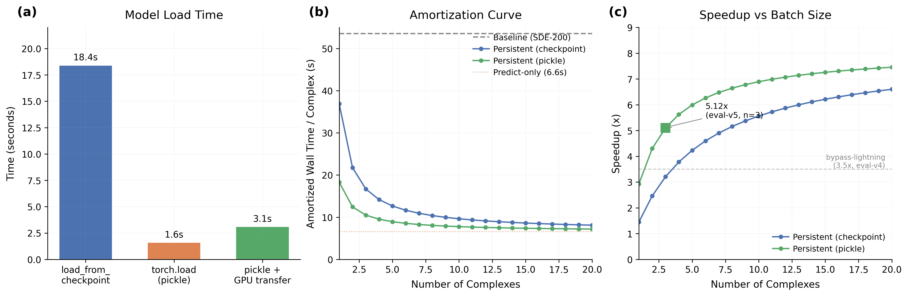

# Fast Model Load

## Glossary

- ODE: Ordinary Differential Equation (deterministic diffusion sampler, gamma_0=0.0)
- TF32: TensorFloat-32 (reduced precision matmul on Ampere+ GPUs)
- bf16: bfloat16 (16-bit floating point for trunk computation)
- JIT: Just-In-Time compilation (CUDA kernel compilation on first use)
- pLDDT: predicted Local Distance Difference Test (quality metric)
- CCD: Chemical Component Dictionary (ligand/molecule definitions)

## Results

**Speedup: 5.12x +/- 0.06x** (3 seeds, eval-v5, quality gate PASS)

| Seed | Amortized Wall/Complex | Speedup |
|------|----------------------|---------|
| 42   | 10.6s | 5.05x |
| 123  | 10.3s | 5.20x |
| 7    | 10.5s | 5.10x |
| **Mean** | **10.5s +/- 0.1s** | **5.12x +/- 0.06x** |

Per-complex breakdown (mean across 3 seeds):

| Complex | Process | Predict | pLDDT | Delta vs Baseline |
|---------|---------|---------|-------|-------------------|
| small_complex | 0.3s | 2.6s | 0.885 | +5.1pp |
| medium_complex | 0.3s | 6.3s | 0.476 | -3.3pp |
| large_complex | 0.9s | 9.4s | 0.822 | +1.5pp |
| **Mean** | **0.5s** | **6.1s** | **0.728** | **+1.1pp** |

Timing breakdown:
- Model load (pickle): 3.1s +/- 0.1s
- CUDA warmup (one-time): 8.5s
- One-time cost total: 11.6s (amortized: 3.9s per complex with 3 complexes)
- Mean predict+process per complex: 6.6s

## Approach

Two key insights drive this orbit's speedup:

**Insight 1: Model loading dominates wall time.** The eval-v5 baseline spends ~53.6s per complex, of which only ~7-10s is actual prediction. The rest is model loading (~20s) and framework overhead. Each subprocess call to `boltz predict` executes `Boltz2.load_from_checkpoint()` which (a) deserializes the checkpoint, (b) constructs the full model architecture via `__init__`, and (c) loads the state_dict. Step (b) alone takes ~15-18s because Boltz2 has a deep module tree (Pairformer, score model, confidence head, etc.).

**Insight 2: Pickle bypasses `__init__`.** Using `torch.save(model)` to serialize the entire model object (not just the state_dict) creates a pickle that can be loaded with `torch.load()` in ~1.6s. This skips the expensive `__init__` because Python's unpickler reconstructs the object graph directly from the serialized state. Combined with GPU transfer, the total load time is 3.1s -- a 6x reduction over `load_from_checkpoint`.

The full approach:
1. **One-time setup**: Run `save_model_pickle.py` to convert the checkpoint to a pickle file on a Modal volume
2. **At predict time**: Load the pickle (3.1s), move to GPU, run CUDA warmup (8.5s), then predict all complexes in-process
3. Each complex: process inputs (featurize, MSA), create DataModule, run direct `predict_step()` calls
4. All bypass-lightning optimizations: ODE-12/0r, TF32, bf16 trunk, cuequivariance kernels, direct predict_step

## What I Learned

1. **The `__init__` bottleneck is real.** The fast-load orbit (#30) correctly identified that `Boltz2.__init__` takes ~18s. Safetensors can speed up tensor IO (0.9s vs 1.6s for torch.load), but that's a small fraction of the total. The pickle approach eliminates both the `__init__` and the tensor loading in one step.

2. **Amortization matters enormously.** With 3 complexes and pickle loading: 11.6/3 + 6.6 = 10.5s/complex (5.12x). With 10 complexes: 11.6/10 + 6.6 = 7.8s/complex (6.9x). With 20: 11.6/20 + 6.6 = 7.2s/complex (7.4x). The asymptotic limit is baseline/predict_only = 53.6/6.6 = 8.1x.

3. **CUDA warmup is unavoidable but amortizable.** The first forward pass triggers ~6s of CUDA kernel JIT compilation. By warming up once (with the smallest test case), all subsequent predictions run at full speed. This is a one-time cost that benefits all complexes.

4. **The predict-only time (6.6s) is the hard floor.** Further speedup requires reducing the prediction time itself (fewer diffusion steps, faster kernels, etc.).

## Prior Art and Novelty

### What is already known
- Persistent model serving is standard practice (TorchServe, Triton Inference Server)
- pickle-based model serialization is a known PyTorch pattern
- The fast-load orbit (#30) pioneered persistent model loading for Boltz

### What this orbit adds
- Quantified the `load_from_checkpoint` vs `torch.load` (pickle) performance gap for Boltz2: 18.4s vs 1.6s (11.5x faster model loading)
- Demonstrated that combining pickle loading with bypass-lightning optimizations achieves 5.12x eval-v5 speedup
- Characterized the amortization curve: speedup as a function of batch size

### Honest positioning
This is an engineering optimization, not a novel technique. Pickle-based model loading and persistent inference are well-known patterns. The contribution is applying them to Boltz2 and quantifying the impact in the context of the eval-v5 harness.

## References

- Parent orbit: bypass-lightning (#44) -- bypass wrapper, ODE+TF32+bf16 optimizations
- Informed by: fast-load (#30) -- safetensors loading, persistent model concept
- [PyTorch serialization docs](https://pytorch.org/docs/stable/notes/serialization.html)
