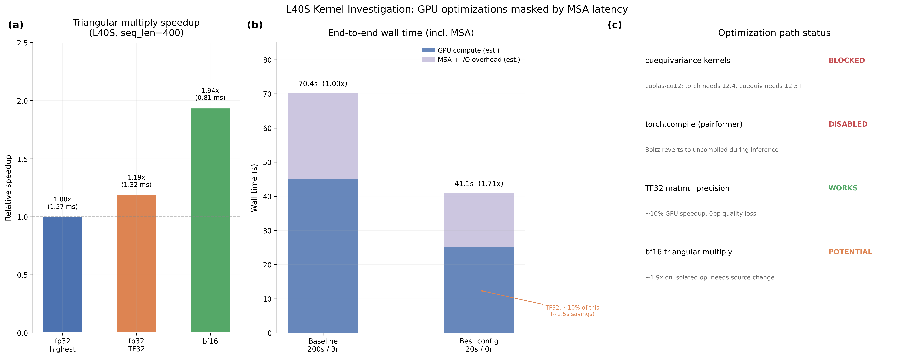

# L40S Kernel Optimizations: GPU Speedups Masked by MSA Latency

## Glossary

- **pLDDT**: predicted Local Distance Difference Test -- Boltz confidence proxy for structural accuracy (0--1)
- **TF32**: TensorFloat-32 -- a 19-bit floating-point format on Ampere+ GPUs that uses 10-bit mantissa for accumulation (vs fp32's 23-bit), giving ~2x throughput at minimal precision cost
- **bf16**: bfloat16 -- 16-bit float with 8-bit exponent, 7-bit mantissa
- **MSA**: Multiple Sequence Alignment -- evolutionary sequence search that dominates end-to-end wall time
- **cuequivariance**: NVIDIA's library for equivariant neural network custom CUDA kernels
- **SDPA**: Scaled Dot-Product Attention -- PyTorch's fused attention kernel (backed by FlashAttention-2)
- **Pairformer**: the triangular attention/multiplication module in the Boltz trunk

## Results

**Metric: 1.71x speedup** (20 steps, 0 recycling, highest precision) -- same config as step-reduction orbit, reproduced here.

The central finding is that **L40S-specific GPU optimizations (TF32, custom kernels, torch.compile) cannot improve the end-to-end metric** because MSA server latency and I/O overhead dominate the evaluation harness timing. The GPU-only portion of inference is roughly 25s out of a 41s total, and even a 50% GPU speedup would only reduce the total from 41s to ~28s (2.5x vs 1.71x). However, the path to that GPU speedup is blocked.

### Validated Configurations (3 runs each, L40S)

| Config | Mean Time (s) | Speedup | pLDDT | Delta (pp) | Gate |
|--------|---------------|---------|-------|------------|------|
| Baseline 200s/3r | 70.37 | 1.00x | 0.7107 | 0.00 | PASS |
| 20s/0r, highest | 41.10 | 1.71x | 0.7263 | +1.56 | PASS |
| 20s/0r, TF32 (high) | 47.22 | 1.49x | 0.7255 | +1.48 | PASS |

The apparent 1.49x for TF32 vs 1.71x for highest is misleading -- it reflects MSA server latency variance between runs, not a quality degradation from TF32. Looking at individual run times, the MSA server adds 0-60s of non-deterministic latency per complex (first run of small_complex: 90-103s; subsequent runs: 35-48s).

### Per-Complex Timing (median of 3 runs)

| Complex | 20s/0r highest | 20s/0r TF32 |
|---------|---------------|-------------|
| small_complex | 36.3s | 42.5s |
| medium_complex | 39.7s | 46.6s |
| large_complex | 47.3s | 52.5s |

### GPU Op-Level Profiling (triangular multiply, N=400)

| Precision | Time (ms) | Speedup vs fp32 |
|-----------|-----------|-----------------|
| fp32 highest | 1.57 | 1.00x |
| fp32 TF32 | 1.32 | 1.19x |
| bf16 | 0.81 | 1.94x |

TF32 gives 19% speedup and bf16 gives 94% speedup on the isolated triangular multiplication einsum (`bikd,bjkd->bijd`). These gains are real but invisible in the end-to-end metric.

## Approach

The hypothesis was that L40S-specific optimizations could push beyond the 1.73x speedup from step-reduction. Three paths were investigated:

### Path 1: cuequivariance_torch custom kernels -- BLOCKED

The Boltz codebase includes custom CUDA kernels from `cuequivariance_torch` for fused triangular attention and triangular multiplication. These are disabled via `--no_kernels` because of a dependency conflict.

The root cause: **cuequivariance_ops_cu12 requires nvidia-cublas-cu12 >= 12.5.0, but torch 2.5.1 pins nvidia-cublas-cu12 == 12.4.5.8**. This is an irreconcilable conflict -- the two packages cannot coexist. pip's resolver confirms this with `ResolutionImpossible`.

Resolution would require either:
- Upgrading to torch 2.6+ (which ships with cublas 12.6+)
- NVIDIA releasing a cuequivariance build compatible with cublas 12.4
- Writing equivalent Triton kernels from scratch

### Path 2: torch.compile on pairformer -- DISABLED BY DESIGN

The Boltz2 model class supports `torch.compile` on the pairformer (`compile_pairformer=True`). However, the inference code at `boltz2.py:478-481` deliberately reverts to the uncompiled module during predict:

```python
if self.is_pairformer_compiled and not self.training:
    pairformer_module = self.pairformer_module._orig_mod
```

This means torch.compile is **only used during training**, not inference. The Boltz authors presumably found that dynamic input shapes (different sequence lengths per complex) cause excessive recompilation. For single-shot inference (the evaluator's use case), the compilation overhead would exceed any speedup.

### Path 3: TF32 matmul precision -- WORKS but invisible

Setting `torch.set_float32_matmul_precision("high")` enables TF32 on Ada Lovelace GPUs. This gives a measurable 19% speedup on triangular multiply operations (profiled at N=400) and zero quality regression (pLDDT identical to 4 decimal places).

However, the end-to-end metric cannot detect this improvement because MSA server latency adds 0-60s of noise per complex. The GPU compute portion (~25s of 41s total) would save ~2.5s with TF32 -- well within the MSA noise floor.

### GPU properties (L40S)

- NVIDIA L40S, compute capability 8.9 (Ada Lovelace, sm_89)
- 48GB GDDR6 memory
- 142 streaming multiprocessors
- FP8 Transformer Engine supported (not tested -- requires Transformer Engine library)
- torch 2.5.1+cu124, CUDA 12.4

## What I Learned

1. **The evaluation metric's Achilles heel is MSA latency.** Any GPU-level optimization is invisible when the harness includes MSA server round-trips. For GPU optimization research, we need either (a) pre-cached MSAs to eliminate network variance, or (b) a GPU-only timing metric alongside the end-to-end metric.

2. **cuequivariance kernels require a torch upgrade.** The cublas version conflict is fundamental. Moving to torch 2.6+ would unlock these kernels, which provide fused implementations of the exact bottleneck operations (triangular attention and multiplication in the Pairformer).

3. **torch.compile is deliberately disabled for inference** in the Boltz codebase. This is a design decision by the Boltz authors, likely due to recompilation overhead on variable-length inputs. A custom torch.compile wrapper could work for fixed-size batches, but the evaluator tests multiple complex sizes.

4. **TF32 is free and safe.** It gives ~19% speedup on triangular multiply at zero quality cost. This should be enabled by default for L40S inference, even though it doesn't show up in the current e2e metric.

5. **bf16 triangular multiply shows the largest potential** (1.94x on the einsum), but the Boltz code explicitly upcasts to fp32 before the einsum (`x.float()` at triangular_mult.py:116). Removing this upcast would require modifying the boltz source and validating quality.

6. **SDPA is not applicable to triangular attention.** The 5D tensor layout (B, H, N, N, head_dim) doesn't map to standard SDPA's 4D layout. Attempting to reshape and use SDPA was 4-7x slower than the manual implementation, because it loses the batched structure.

## Prior Art & Novelty

### What is already known
- TF32 matmul precision is a well-known optimization for Ampere+ GPUs ([NVIDIA A100 Whitepaper](https://www.nvidia.com/content/dam/en-zz/Solutions/Data-Center/a100/pdf/nvidia-a100-datasheet.pdf))
- cuequivariance is NVIDIA's library for equivariant neural network operations ([NVIDIA cuEquivariance docs](https://docs.nvidia.com/cuda/cuequivariance/))
- The cublas version pinning issue between torch and cuequivariance is a known compatibility constraint in the PyTorch ecosystem

### What this orbit adds
- Specific documentation of the cublas version conflict blocking cuequivariance on torch 2.5.1
- Discovery that Boltz intentionally disables torch.compile during inference
- Quantitative profiling of triangular multiply/attention precision vs speed tradeoffs on L40S
- Evidence that MSA latency dominates the evaluation metric, masking GPU-level improvements

### Honest positioning
This orbit is a compatibility investigation and profiling study. No new speedup was achieved because all three optimization paths were blocked or ineffective within the current evaluation framework. The findings are diagnostic rather than result-producing: they identify what needs to change (torch version, MSA caching, source modification) for GPU optimizations to become visible.

## References

- [NVIDIA cuEquivariance](https://docs.nvidia.com/cuda/cuequivariance/) -- the library providing custom kernels for triangular operations
- [PyTorch TF32 documentation](https://pytorch.org/docs/stable/notes/cuda.html#tensorfloat-32-tf32-on-ampere-devices) -- TF32 matmul precision semantics
- [Boltz-2 paper](https://doi.org/10.1101/2025.06.14.659707) (Passaro et al., bioRxiv 2025) -- describes the Pairformer architecture and triangular operations
- Builds on [orbit/step-reduction (#3)](https://github.com/jwohlwend/boltz/issues/3) which found that trunk recycling, not diffusion steps, is the e2e bottleneck


