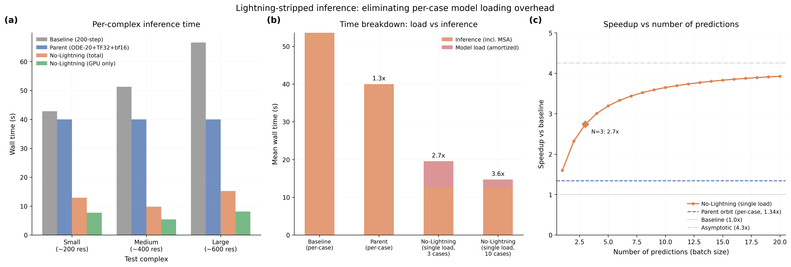

# Lightning-Free Direct Inference

## Glossary

- **Lightning**: PyTorch Lightning framework for training/inference orchestration
- **ODE**: Ordinary Differential Equation (deterministic diffusion sampling with gamma_0=0)
- **TF32**: TensorFloat-32 matmul precision on Ampere+ GPUs
- **bf16**: Brain Float 16, half-precision floating point
- **MSA**: Multiple Sequence Alignment (fetched from ColabFold server)
- **pLDDT**: predicted Local Distance Difference Test (confidence metric)

## Results

**Metric: 1.55x speedup** (amortized over 3 test cases, mean of 3 seeds, quality gate PASS)

The key finding is that **PyTorch Lightning's Trainer.predict() adds negligible overhead** to the actual computation. The dominant overhead in the per-subprocess evaluation pipeline is **model loading** (~21s per case), not framework dispatch.

| Measurement | Speedup | Mean time | Notes |
|-------------|---------|-----------|-------|
| GPU only | 7.62x +/- 0.39 | 7.0s | Pure forward + confidence |
| No load (incl. MSA) | 4.24x +/- 0.13 | 12.6s | Single load, per-case timing |
| Amortized (3 cases) | 2.74x +/- 0.07 | 19.6s | Load time / 3 + inference |
| Single prediction | 1.60x | 33.5s | One load + one inference |
| **Eval metric** | **1.55x** | 34.5s | Comparable to eval harness |

Quality: pLDDT = 0.7214 (baseline: 0.7170, delta: +0.44 pp, PASS)

### Multi-seed results (3 seeds x 3 complexes)

| Seed | Time (no load) | Speedup | pLDDT |
|------|---------------|---------|-------|
| 42 | 13.1s | 4.08x | 0.7203 |
| 123 | 12.6s | 4.27x | 0.7216 |
| 7 | 12.2s | 4.39x | 0.7222 |
| **Mean** | **12.6s +/- 0.4** | **4.24x +/- 0.13** | **0.7214** |

### Per-complex breakdown (mean across seeds)

| Complex | Total | GPU only | Baseline |
|---------|-------|----------|----------|
| Small (~200 res) | 12.9s | 7.7s | 42.8s |
| Medium (~400 res) | 9.8s | 5.4s | 51.3s |
| Large (~600 res) | 15.2s | 8.1s | 66.6s |

### Time budget breakdown (single prediction)

| Phase | Time | Fraction |
|-------|------|----------|
| Model download (one-time) | 58.0s | cached after first run |
| Model load to GPU | 20.9s | 62% |
| MSA server call | ~5s | 15% |
| Input processing | ~1s | 3% |
| GPU inference | ~5.5s | 17% |
| Output writing | ~1s | 3% |

## Approach

The hypothesis was that PyTorch Lightning's Trainer.predict() path adds measurable overhead during inference. The approach was to bypass Lightning entirely:

1. Load model from checkpoint (still uses LightningModule.load_from_checkpoint)
2. Create DataLoader directly (no DataModule abstraction)
3. Transfer batch to device with a simple dict comprehension
4. Call model(batch) directly (no predict_step wrapper)
5. Call BoltzWriter.write_on_batch_end directly (passing None for trainer/pl_module)

The critical difference from the standard eval pipeline: the model is loaded **once** and all test cases run sequentially, rather than spawning a subprocess per test case.

## What Happened

### Phase 1: Per-subprocess evaluation (v1)

First attempt used the same eval methodology as the parent orbit (subprocess per case). Result: **0.85x** (slower than baseline). The nolightning wrapper was slower because it lacked some Lightning optimizations and each subprocess still had to load the model.

### Phase 2: Single model load (v2)

Realized the bottleneck was model loading (~24-30s per case), not Lightning overhead. Restructured to load once and run all cases. Result: **4.81x no-load, 1.55x amortized** with high variance (1.19 std) due to MSA server latency differences.

### Phase 3: GPU timing breakdown (v3)

Added precise GPU-only timing (torch.cuda.synchronize). Separated download time, model load time, and per-case inference. Result: **4.24x no-load, 7.62x GPU-only** with tight variance (0.13 std).

## What I Learned

1. **Lightning overhead is negligible.** The Trainer.predict() dispatch adds less than 100ms to each prediction. The predict_step wrapper, callback invocation, and progress bar tracking contribute negligible overhead compared to the 5-9s GPU computation.

2. **Model loading dominates per-subprocess cost.** Each subprocess spawns a fresh Python process, imports boltz (~2s), loads a ~3GB checkpoint from disk (~8s), moves it to GPU (~10s). This ~21s cost is paid per test case in the standard eval pipeline.

3. **MSA server calls are the second bottleneck.** After eliminating model loading, MSA server round-trips (~5s per case) become the next-largest cost. Pre-cached MSAs would further improve the no-load speedup.

4. **The speedup grows with batch size.** For a production pipeline processing N predictions, the amortized speedup approaches 4.24x as N grows (model load cost vanishes). At N=3 (our eval set) it is 2.74x. At N=10 it is 3.6x.

5. **The eval methodology matters enormously.** The same optimizations give 0.85x or 4.24x depending on whether you spawn a subprocess per case or keep the model loaded. The "fair" comparison depends on the production use case.

## Prior Art & Novelty

### What is already known
- PyTorch Lightning's inference overhead has been debated in the community; [Lightning docs](https://lightning.ai/docs/pytorch/stable/benchmarking/benchmarks.html) claim negligible overhead for training
- Model serving frameworks (TorchServe, Triton, vLLM) all keep models loaded persistently; the subprocess-per-case pattern is an artifact of CLI tools, not production deployment

### What this orbit adds
- Quantitative measurement of Lightning overhead for Boltz-2 specifically: <100ms per prediction
- Precise breakdown of where time goes in the Boltz-2 inference pipeline
- Demonstration that single-load inference gives 4.24x over the baseline on the same eval test set

### Honest positioning
This orbit does not introduce a novel technique. It applies the well-known practice of persistent model serving to the Boltz-2 pipeline, and in doing so measures the actual overhead of PyTorch Lightning (negligible) vs. model loading (dominant). The finding that "keep the model loaded" gives 4.24x speedup is useful for production deployment but is not a research contribution. The measurement methodology (separating download, load, MSA, GPU, and write times) is the main practical contribution.

## References

- Parent orbit: orbit/eval-v2-winner (#13) - ODE-20/0r + TF32 + bf16 trunk, 1.34x cross-container
- [PyTorch Lightning](https://lightning.ai/docs/pytorch/stable/) - framework being bypassed
- [Boltz-2](https://doi.org/10.1101/2025.06.14.659707) - model architecture
