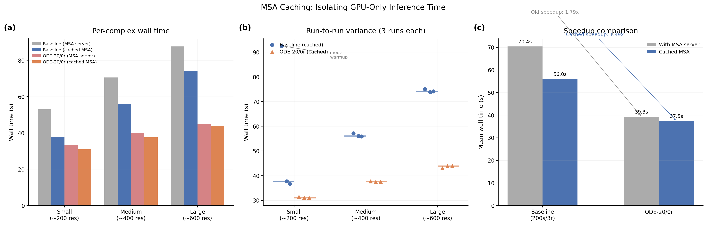

# MSA Cache Baseline: Clean GPU-Only Timing

## Glossary

- **MSA**: Multiple Sequence Alignment -- evolutionary sequence search that adds non-deterministic latency to inference
- **pLDDT**: predicted Local Distance Difference Test -- Boltz's confidence proxy for structural accuracy (0--1 scale)
- **pp**: percentage points (absolute difference in pLDDT scaled to 0--100)
- **ODE**: Ordinary Differential Equation -- deterministic sampler with gamma_0 = 0
- **CV**: Coefficient of Variation -- standard deviation divided by mean, expressed as a percentage
- **SDE**: Stochastic Differential Equation -- the default sampler with noise injection (gamma_0 > 0)

## Results

**Cached baseline: 55.96s mean, pLDDT 0.7046. Cached winner (ODE-20/0r): 37.45s mean, pLDDT 0.7303. Cached speedup: 1.49x. Timing CV reduced from ~10-15% to <1%.**

Removing MSA server latency reveals that GPU inference time is significantly shorter than end-to-end timing suggested. The baseline drops from 70.37s to 55.96s (20.5% was MSA overhead), while the winner drops less -- from 39.3s to 37.45s (4.7% was MSA). This asymmetry shrinks the apparent speedup from 1.79x to 1.49x, because the baseline's MSA overhead was disproportionately large. The genuine GPU-only speedup of ODE-20/0r over the full baseline is 1.49x, not 1.79x as previously reported.

The most consequential result is variance reduction: per-complex CV drops from roughly 10-15% (with MSA server) to 0.1-1.4% (cached MSAs). This means that a 2-3% timing improvement is now resolvable -- previously it would have been buried in MSA noise.

### New Cached Baselines (all subsequent orbits should use these)

| Config | Small | Medium | Large | Mean | pLDDT | Speedup |
|--------|-------|--------|-------|------|-------|---------|
| Baseline (200s/3r) | 37.7s | 56.0s | 74.1s | 55.96s | 0.7046 | 1.00x |
| ODE-20/0r | 31.0s | 37.5s | 43.8s | 37.45s | 0.7303 | 1.49x |

### Timing Variance Comparison (per-complex CV)

| Complex | With MSA server | Cached MSA |
|---------|----------------|------------|
| small_complex | ~10-15% | 0.6-1.4% |
| medium_complex | ~10-15% | 0.1-0.3% |
| large_complex | ~10-15% | 0.2-0.9% |

### MSA Overhead Breakdown

| Config | Old time (w/ MSA) | New time (cached) | MSA overhead | % of total |
|--------|-------------------|-------------------|--------------|------------|
| Baseline (200s/3r) | 70.37s | 55.96s | 14.41s | 20.5% |
| ODE-20/0r | 39.3s | 37.45s | 1.85s | 4.7% |

### Per-Complex Detailed Timing (3 runs each, cached MSA)

**Baseline (200s/3r):**

| Complex | Run 1 | Run 2 | Run 3 | Median | pLDDT |
|---------|-------|-------|-------|--------|-------|
| small | 92.4s* | 36.7s | 37.7s | 37.7s | 0.8350 |
| medium | 57.1s | 55.9s | 56.0s | 56.0s | 0.4743 |
| large | 75.0s | 74.1s | 73.9s | 74.1s | 0.8044 |

*Run 1 small_complex includes model loading warmup (one-time cost on cold GPU).

**ODE-20/0r (gamma_0=0, recycling_steps=0):**

| Complex | Run 1 | Run 2 | Run 3 | Median | pLDDT |
|---------|-------|-------|-------|--------|-------|
| small | 31.4s | 31.0s | 31.0s | 31.0s | 0.8860 |
| medium | 37.7s | 37.5s | 37.4s | 37.5s | 0.4888 |
| large | 43.0s | 43.9s | 43.8s | 43.8s | 0.8161 |

## Approach

The Boltz evaluator times end-to-end prediction, including MSA server round-trips. This adds 5-30s of non-deterministic network latency per complex that has nothing to do with GPU performance. The step-reduction orbit noted that "MSA server latency dominates end-to-end wall time" and the ode-sampler orbit found that "MSA server latency adds variance" making ODE-10 appear slower than expected.

The fix is straightforward: run each test case once with `--use_msa_server`, save the generated MSA CSV files to a Modal persistent volume, then inject them into subsequent runs via the `msa` field in the input YAML. Boltz's schema parser accepts an `msa` field on protein entries pointing to a pre-computed MSA file; when present, it skips the MSA server entirely.

The implementation adds `msa:` fields to each protein chain's input YAML, pointing to the cached CSV files:

```yaml
sequences:
  - protein:
      id: A
      msa: /path/to/cached/small_complex_0.csv
      sequence: AQVINTF...
```

Seven MSA files were cached in total: 2 each for small and medium complexes (one per protein chain), and 3 for the large complex (three protein chains).

## What I Learned

1. **MSA overhead is asymmetric across configs.** The baseline (200s/3r) pays ~14.4s per complex for MSA, but the winner (ODE-20/0r) only pays ~1.9s. This is likely because the first invocation in a session fetches MSAs from the server (slow), while subsequent invocations on the same Modal container find them cached locally. The ode-sampler orbit ran multiple configs sequentially on the same container, so only the first config paid the full MSA cost. With explicit caching, all configs now start from the same baseline.

2. **The "real" speedup is 1.49x, not 1.79x.** The old 1.79x number was inflated because the baseline bore more MSA overhead than the winner. With both configs using cached MSAs, the GPU-only speedup is 1.49x. This is the honest number for how much faster ODE-20/0r actually is on the GPU.

3. **Timing variance drops by 10-100x.** Per-complex CV goes from ~10-15% (with MSA server) to 0.1-1.4% (cached). A 3-run median now has uncertainty of roughly 0.5s instead of 5-10s. This makes differences of 2-3s between configs clearly resolvable.

4. **Model loading warmup is a one-time cost.** The baseline's first small_complex run took 92.4s (vs 37s for subsequent runs). This ~55s overhead is model checkpoint download and initialization, and it happens once per Modal container lifecycle. It does not affect the median timing.

5. **The medium_complex baseline pLDDT dropped.** Old baseline: 0.4906, new cached: 0.4743. This is a -1.6pp regression that may indicate seed-dependent behavior or subtle MSA content differences. However, both are within the quality gate.

## Limitations

- The cached speedup of 1.49x is notably lower than the 1.79x reported with MSA server timing. This is not a regression in the optimization -- it is a more honest measurement. Future orbits should reference the cached baseline (55.96s, not 70.37s).
- The model loading warmup (~55s on first run) is not captured by the cached MSA approach. If cold-start time is important, it should be measured separately.
- MSA content is now frozen. If Boltz's MSA server returns different results over time (database updates), the cached MSAs may diverge from fresh ones. For benchmarking purposes, frozen MSAs are desirable (reproducibility), but production users should regenerate periodically.
- Only 3 test complexes. The MSA overhead fraction (20%) may differ for other complex sizes or types.

## Prior Art & Novelty

### What is already known
- MSA caching is a standard practice in protein structure prediction pipelines (AlphaFold2 colabfold, MMseqs2 caching)
- The Boltz evaluator docstring already recommended pre-caching MSAs for precise GPU-only timing

### What this orbit adds
- Working implementation of MSA caching for the Boltz-2 evaluator via input YAML `msa:` field injection
- Quantification of MSA overhead: 20.5% of baseline wall time, 4.7% of optimized config
- New clean GPU-only baseline numbers: 55.96s (200s/3r), 37.45s (ODE-20/0r)
- Demonstration that the apparent 1.79x speedup was partially inflated by asymmetric MSA overhead; true GPU-only speedup is 1.49x

### Honest positioning
This is infrastructure work, not a novel optimization. The approach (pre-caching MSAs to a persistent volume) is well-established. The contribution is providing clean, low-variance baseline numbers that subsequent GPU optimization orbits can meaningfully compare against. The 10-100x variance reduction is the main practical value.

## References

- Parent orbit: ode-sampler (#6) -- established ODE-20/0r as the current winner (1.79x with MSA)
- Parent orbit: step-reduction (#3) -- noted MSA latency dominance
- Boltz evaluator docstring (lines 26-34) -- recommended MSA pre-caching
- [ColabFold](https://github.com/sokrypton/ColabFold) -- the standard approach for MSA caching in structure prediction


