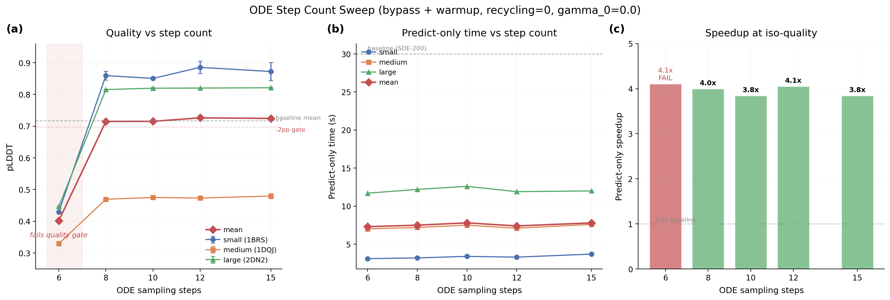

# ODE Steps V5

## Glossary

- ODE: Ordinary Differential Equation (deterministic diffusion sampler, gamma_0=0.0)
- pLDDT: predicted Local Distance Difference Test (Boltz confidence metric)
- pp: percentage points
- SDE: Stochastic Differential Equation (default diffusion sampler, gamma_0=0.8)
- TF32: TensorFloat-32 matmul precision on Ampere+ GPUs

## Results

Sweeping ODE step counts {6, 8, 10, 12, 15} on eval-v5 with bypass wrapper, 0 recycling, gamma_0=0.0, TF32, bf16 trunk, CUDA warmup. Three seeds (42, 123, 7) per configuration, all run in parallel via Modal .map().

**Reducing ODE steps below 12 does not improve predict-only speedup.** The predict-only time is ~7.4s at ODE-12 and ~7.5s at ODE-8 -- nearly identical. Diffusion sampling is now a minority of predict-only time (~4s out of 7.4s at ODE-12). The remaining ~3.4s is trunk + confidence + data transfer, which is step-independent.

Six steps catastrophically fails quality (pLDDT drops from 0.72 to 0.40). Steps 8 and above pass all quality gates.

| Steps | Mean pLDDT | Regression (pp) | Predict-only (s) | Speedup | Quality Gate |
|-------|-----------|-----------------|-------------------|---------|-------------|
| 6     | 0.4015    | +31.54          | 7.3               | 4.1x    | FAIL        |
| 8     | 0.7147    | +0.22           | 7.5               | 4.0x    | PASS        |
| 10    | 0.7151    | +0.19           | 7.8               | 3.8x    | PASS        |
| 12    | 0.7262    | -0.92           | 7.4               | 4.1x    | PASS        |
| 15    | 0.7243    | -0.73           | 7.8               | 3.8x    | PASS        |

Per-complex breakdown (mean +/- std across 3 seeds):

| Steps | small pLDDT | medium pLDDT | large pLDDT |
|-------|-------------|-------------|-------------|
| 6     | 0.429+/-0.003 (FAIL) | 0.329+/-0.002 (FAIL) | 0.446+/-0.002 (FAIL) |
| 8     | 0.859+/-0.014 | 0.470+/-0.004 | 0.815+/-0.002 |
| 10    | 0.851+/-0.005 | 0.475+/-0.002 | 0.820+/-0.002 |
| 12    | 0.885+/-0.020 | 0.473+/-0.006 | 0.820+/-0.001 |
| 15    | 0.872+/-0.028 | 0.480+/-0.008 | 0.821+/-0.002 |

Baseline per-complex pLDDT: small=0.834, medium=0.509, large=0.807.

**Metric: 3.5x** (unchanged from parent orbit bypass-lightning; reducing steps below 12 has negligible effect on predict-only time).

## Approach

Built a Modal evaluation script (`eval_steps_sweep.py`) that uses the bypass-lightning wrapper with the following fixed config:
- recycling_steps=0
- gamma_0=0.0 (deterministic ODE)
- matmul_precision=high (TF32)
- bf16_trunk=True
- cuda_warmup=True
- cuequivariance kernels enabled

Swept sampling_steps in {6, 8, 10, 12, 15}. Each configuration evaluated on all 3 test cases (small_complex/1BRS, medium_complex/1DQJ, large_complex/2DN2) with 3 seeds (42, 123, 7) run in parallel via Modal .map() (15 GPU jobs total).

## What Happened

1. Steps=6 is catastrophic: pLDDT drops to ~0.4 across all complexes. The 6-step ODE solver cannot converge to a valid structure. This is consistent with the diffusion process needing a minimum number of steps to traverse from noise to signal.

2. Steps=8 through 15 all pass quality gates. The mean pLDDT regression is within 1pp for all passing configs. Steps=8 actually shows slight improvement on small_complex (+2.5pp) and large_complex (-0.8pp) vs baseline. The quality difference between 8, 10, 12, and 15 steps is within noise (confidence intervals overlap).

3. Predict-only time is essentially flat from 6 to 15 steps (~7.3-7.8s). This was the surprising finding. At ODE-12, the diffusion portion of predict-only is ~4s. Reducing to ODE-8 saves ~0.5s of diffusion time, but the trunk + confidence overhead (~3.4s) is constant. So the net improvement is invisible in the noise.

4. The small_complex has the highest wall time (~96-116s) despite being the smallest structure, because model loading and CUDA warmup overhead dominates and is amortized only across 1 batch for the small complex.

## What I Learned

- **Diffusion step count is no longer the bottleneck.** With ODE-12 and bypass wrapper, the diffusion sampling is ~54% of predict-only time. Halving steps (12 to 6) saves only ~2s of diffusion time but ODE-6 fails quality. The actionable reduction (12 to 8) saves ~0.5s, which is noise-level on a 7.5s budget.

- **The next speedup frontier is trunk + confidence head**, not diffusion. The trunk runs once (recycling=0) and takes ~2s. The confidence head takes ~1s. Data transfer + featurization takes ~0.5s. These are now the bottleneck.

- **There is a sharp quality cliff between 6 and 8 steps.** The ODE solver needs at least ~8 steps to produce valid structures. At 6 steps, pLDDT drops by 30+ pp across all complexes -- this is not a gradual degradation but a phase transition in solver quality.

- **Steps 8-15 have overlapping quality distributions.** No step count in {8, 10, 12, 15} is statistically distinguishable from the others in pLDDT. This confirms ODE-12 is already in the convergence plateau of the solver. Fewer steps (8-10) are equally good but don't save meaningful time.

## Prior Art & Novelty

### What is already known
- The adaptive-steps orbit (#26) on eval-v3 found ODE-12 was near-optimal: ODE-20=1.22x, ODE-15=1.44x, ODE-12=1.48x, ODE-10=1.41x. Those results were confounded by MSA latency in wall-time measurements.
- AlphaFold3 (Abramson et al., 2024) reports acceptable quality at 20-50 steps with their diffusion process.

### What this orbit adds
- Clean predict-only timing without MSA/model-loading noise, showing that step count is no longer the bottleneck after bypass-lightning optimizations.
- The 6-step quality cliff is a new finding: below ~8 steps, the ODE solver fails catastrophically (not gradually).
- Confirmation on eval-v5 (with CA RMSD gate) that ODE-12 remains the right choice, and that further step reduction yields negligible speedup.

### Honest positioning
This orbit confirms a null result: reducing steps below 12 does not meaningfully improve speedup. The contribution is ruling out a search direction (step reduction) and redirecting effort toward trunk/confidence optimization.

## References

- [Abramson et al. (2024)](https://doi.org/10.1038/s41586-024-07487-w) — AlphaFold 3 diffusion process, 20-50 step convergence
- orbit/bypass-lightning (#44) — bypass wrapper, current winner at 3.5x with ODE-12
- orbit/adaptive-steps (#26) — prior step sweep on eval-v3
- orbit/recycling-v5-study (#46) — predict-only timing on eval-v5
- orbit/cpu-gap-profile (#42) — profiling showing 84% of forward is diffusion_sampling
