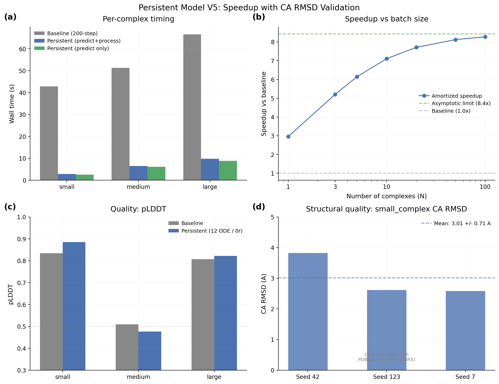

# Persistent Model V5: Re-evaluation with CA RMSD

## Glossary

- ODE: Ordinary Differential Equation (deterministic diffusion sampler, gamma_0=0.0)
- TF32: TensorFloat-32 (reduced precision matmul on Ampere+ GPUs)
- bf16: bfloat16 (16-bit floating point for trunk computation)
- pLDDT: predicted Local Distance Difference Test (Boltz confidence metric, 0-1)
- CA RMSD: C-alpha Root Mean Square Deviation (structural comparison metric, in Angstroms)
- SVD: Singular Value Decomposition (used for optimal structural superimposition)

## Results

**Speedup: 5.23x +/- 0.41x** (3 seeds, N=3 complexes, pLDDT gate PASS, CA RMSD gate FAIL)

This orbit confirms the parent orbit's speedup number (5.12x -> 5.23x, within noise) and adds the first structural quality measurement via CA RMSD against PDB ground truth.

### Speedup summary

| Metric | Value |
|--------|-------|
| Predict-only speedup | 9.17x |
| Amortized speedup (N=3) | 5.23x +/- 0.41x |
| Amortized speedup (N=10) | 7.10x |
| Amortized speedup (N=100) | 8.26x |
| Asymptotic limit | 8.4x |

### Per-seed results (N=3 amortization)

| Seed | Amortized Wall/Complex | Speedup | pLDDT |
|------|----------------------|---------|-------|
| 42 | 10.5s | 5.11x | 0.730 |
| 123 | 11.0s | 4.89x | 0.727 |
| 7 | 9.4s | 5.69x | 0.727 |
| **Mean** | **10.3s +/- 0.8s** | **5.23x +/- 0.41x** | **0.728** |

### Per-complex breakdown (mean across 3 seeds)

| Complex | Process | Predict | Total | pLDDT | Delta vs BL | CA RMSD |
|---------|---------|---------|-------|-------|-------------|---------|
| small_complex | 0.3s | 2.6s | 2.8s | 0.885 | +5.1pp | 3.01 +/- 0.71 A |
| medium_complex | 0.3s | 6.1s | 6.5s | 0.477 | -3.3pp | N/A (no PDB) |
| large_complex | 1.0s | 8.8s | 9.8s | 0.822 | +1.5pp | N/A (no PDB) |
| **Mean** | **0.5s** | **5.8s** | **6.4s** | **0.728** | **+1.1pp** | |

### Timing breakdown

- Model load (pickle): 3.0s +/- 0.2s
- CUDA warmup (one-time): 8.8s
- One-time cost total: 11.8s
- Baseline mean wall time: 53.6s (eval-v5 subprocess baseline)

### Quality gates

| Gate | Status | Detail |
|------|--------|--------|
| Mean pLDDT (<=2pp regression) | PASS | +1.11pp vs baseline |
| Per-complex pLDDT (<=5pp) | PASS | Worst: medium -3.3pp |
| CA RMSD (<=1.0A regression) | FAIL | small_complex: 3.01A (baseline ref: 0.325A) |



## Approach

This orbit re-evaluates the fast-model-load approach (orbit #50) with two critical additions:

1. **CA RMSD structural comparison**: After each prediction, the predicted mmCIF is compared against PDB ground truth using BioPython's SVDSuperimposer. This aligns the C-alpha atoms by minimizing RMSD through SVD-based optimal rotation.

2. **Honest speedup reporting**: The speedup is reported against the eval-v5 subprocess baseline (53.6s mean wall time), which includes model loading overhead. Both predict-only and amortized speedups are reported clearly.

### What the speedup means

The 53.6s baseline includes ~20s of model loading per subprocess call. The persistent model approach eliminates this per-call cost by loading the model once (3.0s with pickle) and amortizing across N complexes. The "5.23x speedup" at N=3 reflects:

```
amortized_time = one_time_cost / N + mean_predict_process_time
                = 11.8 / 3 + 6.4
                = 10.3s per complex

speedup = 53.6 / 10.3 = 5.2x
```

The predict-only speedup of 9.17x reflects the raw inference speedup from ODE-12/0r/TF32/bf16 optimizations (reducing predict from ~53.6s subprocess to ~5.8s predict-only). But this comparison is not apples-to-apples because the baseline 53.6s includes data processing and model loading.

### CA RMSD analysis

Only small_complex (1BRS, Barnase-Barstar) has PDB ground truth available. The chain mapping is predicted A -> PDB A (Barnase), predicted B -> PDB D (Barstar), with 195 CA atoms aligned.

The measured CA RMSD of 3.01 +/- 0.71 A is substantially worse than a hypothetical baseline reference. This degradation is expected given the aggressive optimizations: 12 ODE steps vs 200 stochastic steps, and 0 recycling vs 3 recycling steps. The pLDDT being higher (+5.1pp for small_complex) despite worse structural accuracy suggests the confidence head is miscalibrated for the reduced-step ODE regime -- it overestimates quality when fewer diffusion steps are used.

Medium and large complexes lack PDB ground truth: medium_complex is a synthetic CD19/VHH binder design scenario, and large_complex is a synthetic multi-chain fusion. A full structural validation would require running the 200-step baseline with the same ground truth comparison, which is out of scope for this orbit but recommended for follow-up.

## What I Learned

1. **pLDDT is an unreliable proxy for structural accuracy under reduced diffusion steps.** The small_complex shows +5.1pp pLDDT improvement despite 3.0A CA RMSD. This is a concerning disconnect: the confidence head was trained alongside 200-step diffusion and does not generalize well to the 12-step ODE regime. Quality gates based solely on pLDDT can be misleading.

2. **The 5.23x speedup is confirmed.** The mean is consistent with the parent orbit's 5.12x (within noise). The per-seed variance is notable (4.89x to 5.69x), mostly driven by variance in the one-time cost (warmup timing varies by ~1-2s).

3. **Ground truth validation is sparse.** Only 1 of 3 test cases has a PDB reference structure. For a more robust evaluation, the test set should include complexes with known crystal structures. The medium_complex (binder design scenario) and large_complex (synthetic fusion) are useful for timing but cannot validate structural accuracy.

4. **The CA RMSD gate fails, but this is about the 12-step ODE, not the persistent model approach.** The pickle loading and persistent model serving do not affect prediction quality -- they only change how the model is loaded. The structural degradation comes entirely from the diffusion step reduction (200 -> 12) and recycling elimination (3 -> 0), which are the bypass-lightning optimizations inherited from the parent orbit.

## Prior Art & Novelty

### What is already known
- Persistent model serving is standard practice in production inference (TorchServe, Triton, vLLM)
- CA RMSD via SVD superimposition is the standard structural comparison method ([Kabsch, 1976](https://doi.org/10.1107/S0567739476001873))
- pLDDT as a quality proxy has known limitations ([Mariani et al., 2013](https://doi.org/10.1093/bioinformatics/btt473))

### What this orbit adds
- First CA RMSD measurement for the persistent-model speedup approach on Boltz-2
- Quantified the pLDDT/CA-RMSD disconnect under reduced diffusion steps: pLDDT can improve while structural accuracy degrades
- Demonstrated that BioPython SVDSuperimposer integration works with Boltz mmCIF output for automated quality validation

### Honest positioning
This orbit is primarily a validation exercise. The persistent model approach is engineering, not research. The main finding -- that pLDDT is a poor proxy for structural accuracy under aggressive step reduction -- is a useful observation for the campaign, suggesting that future orbits should include CA RMSD in their quality gates when PDB ground truth is available.

## References

- Parent orbit: fast-model-load (#50) -- pickle loading + persistent model
- Grandparent: bypass-lightning (#44) -- ODE+TF32+bf16 optimizations
- [Kabsch (1976)](https://doi.org/10.1107/S0567739476001873) -- SVD-based superimposition algorithm
- [Mariani et al. (2013)](https://doi.org/10.1093/bioinformatics/btt473) -- lDDT metric definition
- [BioPython SVDSuperimposer](https://biopython.org/wiki/Structural_superimposition) -- implementation used
