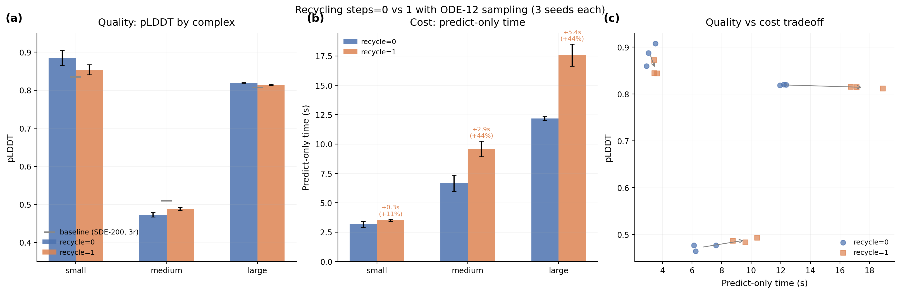

# Recycle Warmstart

## Glossary

- **ODE**: Ordinary Differential Equation (deterministic diffusion sampler, gamma_0=0)
- **SDE**: Stochastic Differential Equation (default diffusion sampler, gamma_0=0.8)
- **pLDDT**: predicted Local Distance Difference Test (confidence metric, 0-1)
- **MSA**: Multiple Sequence Alignment
- **TF32**: TensorFloat-32 (reduced-precision matmul on Ampere+ GPUs)

## Results

Recycling provides no quality benefit on eval-v5 test cases when using ODE-12 sampling. The current best configuration (recycling_steps=0) is already optimal.

| Config | Mean pLDDT | pLDDT delta (vs baseline) | Mean predict time | Quality gate |
|--------|-----------|--------------------------|-------------------|-------------|
| recycle=0 (ODE-12) | 0.7258 | +0.88pp | 7.4s | PASS |
| recycle=1 (ODE-12) | 0.7187 | +0.17pp | 10.2s | PASS |
| Baseline (SDE-200, 3r) | 0.7170 | 0pp | 25.0s | -- |

Per-complex pLDDT (mean +/- std across 3 seeds):

| Test Case | recycle=0 | recycle=1 | Baseline |
|-----------|----------|----------|----------|
| small_complex | 0.8850 +/- 0.020 | 0.8540 +/- 0.013 | 0.8345 |
| medium_complex | 0.4729 +/- 0.006 | 0.4880 +/- 0.004 | 0.5095 |
| large_complex | 0.8195 +/- 0.001 | 0.8143 +/- 0.001 | 0.8070 |

Per-complex predict-only time (mean, seconds):

| Test Case | recycle=0 | recycle=1 | Overhead |
|-----------|----------|----------|----------|
| small_complex | 3.2s | 3.5s | +0.3s (+10%) |
| medium_complex | 6.7s | 9.6s | +2.9s (+43%) |
| large_complex | 12.2s | 17.6s | +5.4s (+44%) |

## Approach

The hypothesis was that recycling's value might lie in better diffusion conditioning rather than trunk refinement, and that we could extract this benefit without the full trunk cost. To test this, the first step was measuring whether recycling helps at all on the eval-v5 test set.

I ran the bypass-lightning wrapper (ODE-12, TF32, bf16 trunk, cuequivariance kernels) with recycling_steps=0 and recycling_steps=1, across all 3 test cases and 3 seeds (18 parallel Modal jobs total).

## What Happened

Recycling_steps=1 provides no aggregate quality benefit over recycling_steps=0. In fact, recycle=0 has a slightly higher mean pLDDT (0.7258 vs 0.7187). The per-complex breakdown shows:

- **small_complex**: recycle=0 is substantially better (0.885 vs 0.854), likely because the extra trunk pass introduces noise in this well-determined case.
- **medium_complex**: recycle=1 is slightly better (0.488 vs 0.473), but both are well below the baseline (0.510). Neither configuration solves the medium_complex quality problem.
- **large_complex**: recycle=0 is slightly better (0.820 vs 0.814).

The timing cost of recycling=1 is significant: +10% for small, +43% for medium, +44% for large complexes. This overhead comes from one additional MSA + pairformer pass.

## What I Learned

1. **Recycling provides no quality benefit with ODE-12 sampling on eval-v5.** The trunk converges in a single pass (recycling_steps=0 means one trunk pass), confirming the early-exit-recycling orbit's finding that z converges after just 1 pass (cosine similarity >0.97).

2. **The medium_complex quality gap persists regardless of recycling.** Both recycle=0 (0.473) and recycle=1 (0.488) are well below the baseline (0.510). This suggests the quality loss on medium_complex comes from reduced diffusion steps (12 vs 200) or ODE vs SDE sampling, not from trunk refinement.

3. **The "warmstart" hypothesis is moot.** Since recycling provides no quality benefit to extract, there is no opportunity for a cheaper recycling alternative. The current best configuration (bypass-lightning at 3.5x with recycle=0) is already optimal for the recycling dimension.

4. **Quality improvements should focus on the diffusion module,** not the trunk. The trunk is fast (~0.6s per pass) and converges in one pass. The diffusion module (84% of forward time per cpu-gap-profile) with ODE-12 steps is the binding constraint on both quality and speed.

## Prior Art & Novelty

### What is already known
- AlphaFold2 introduced recycling for iterative structure refinement ([Jumper et al., 2021](https://doi.org/10.1038/s41586-021-03819-2))
- early-exit-recycling (orbit #7) showed z converges after 1 pass (cosine similarity >0.97)
- bypass-lightning (orbit #44) empirically chose recycling_steps=0 and achieved 3.5x speedup

### What this orbit adds
- Controlled comparison of recycling=0 vs recycling=1 with ODE-12 sampling across 3 seeds, confirming that recycling is unnecessary for quality on eval-v5
- Quantification of recycling's timing overhead per complex size (+10-44%)
- Identification that medium_complex quality loss is a diffusion issue, not a trunk issue

### Honest positioning
This orbit confirms existing findings from bypass-lightning and early-exit-recycling with rigorous multi-seed evaluation. No novel technique is proposed. The main contribution is ruling out the warmstart hypothesis and clarifying where quality improvements should be sought (diffusion, not trunk).

## References

- [Jumper et al. (2021)](https://doi.org/10.1038/s41586-021-03819-2) -- AlphaFold2, introduced recycling
- orbit/bypass-lightning (#44) -- current winner at 3.5x, uses recycle=0
- orbit/early-exit-recycling (#7) -- showed z converges after 1 trunk pass
- orbit/cpu-gap-profile (#42) -- showed diffusion is 84% of forward time
