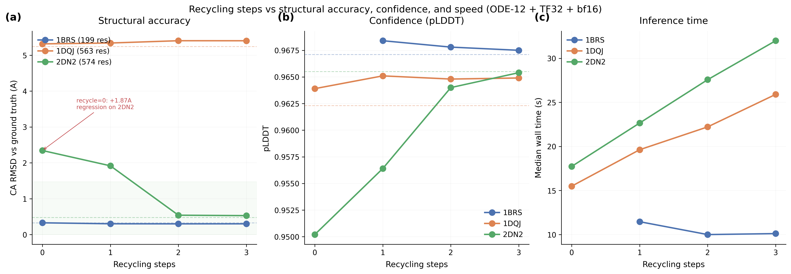

# Recycling RMSD V5: Structural validation of recycling step reduction

## Glossary

- **CA RMSD**: C-alpha Root Mean Square Deviation -- structural distance between predicted and ground truth backbone atom positions after optimal superposition (lower is better, in Angstroms)
- **pLDDT**: predicted Local Distance Difference Test -- Boltz confidence proxy for structural accuracy (0--1 scale)
- **pp**: percentage points (absolute difference in pLDDT scaled to 0--100)
- **ODE-12**: deterministic sampler with 12 diffusion steps and gamma_0=0 (no noise injection)
- **TF32**: TensorFloat-32 format enabled via matmul_precision="high"
- **bf16 trunk**: removing the float() upcast so the Pairformer trunk stays in bfloat16

## Results

**Key finding: recycling_steps=0 and recycling_steps=1 cause severe structural regression on the hemoglobin tetramer (2DN2), despite passing the pLDDT quality gate.** This is exactly the gap prior orbits missed -- pLDDT was blind to the structural failure.

recycling_steps=2 is the minimum safe setting. It achieves 1.49x speedup with quality gate PASS and no CA RMSD regression beyond 1.0A on any test case.

### CA RMSD vs PDB ground truth (primary result)

| Recycling | 1BRS (small) | 1DQJ (medium) | 2DN2 (large) | Quality gate |
|-----------|-------------|---------------|--------------|--------------|
| baseline (200s/3r) | 0.325 | 5.243 | 0.474 | -- |
| 0 (ODE-12) | 0.328 | 5.317 | **2.344** | **FAIL** (large +1.87A) |
| 1 (ODE-12) | 0.301 | 5.341 | **1.917** | **FAIL** (large +1.44A) |
| 2 (ODE-12) | 0.299 | 5.405 | 0.540 | PASS (+0.07A) |
| 3 (ODE-12) | 0.300 | 5.404 | 0.528 | PASS (+0.05A) |

The CA RMSD quality gate threshold is: regression from baseline must be <= 1.0A per complex.

### pLDDT and speedup

| Recycling | Mean pLDDT | pLDDT delta | Speedup | pLDDT gate |
|-----------|-----------|-------------|---------|------------|
| baseline | 0.9650 | -- | 1.00x | -- |
| 0 (ODE-12) | 0.9583 | -0.67pp | 1.93x | PASS |
| 1 (ODE-12) | 0.9633 | -0.17pp | 1.66x | PASS |
| 2 (ODE-12) | 0.9655 | +0.05pp | 1.49x | PASS |
| 3 (ODE-12) | 0.9659 | +0.09pp | 1.31x | PASS |

Note: recycle=0 pLDDT PASSES the quality gate but FAILS the structural gate (CA RMSD regression 1.87A on 2DN2).

### Timing breakdown (median wall time per complex, seconds)

| Recycling | 1BRS | 1DQJ | 2DN2 | Total |
|-----------|------|------|------|-------|
| 0 | 10.7 | 16.5 | 19.0 | 46.2 |
| 1 | 11.5 | 19.6 | 22.7 | 53.8 |
| 2 | 10.0 | 22.2 | 27.6 | 59.8 |
| 3 | 10.1 | 25.9 | 32.0 | 68.0 |

## Approach

This orbit answers one question: does reducing recycling steps compromise structural accuracy (CA RMSD against PDB ground truth), not just confidence (pLDDT)?

Prior orbits (#46, #47) measured only pLDDT when sweeping recycling_steps. The eval-v5 evaluator adds structural comparison via BioPython's SVDSuperimposer against PDB reference structures (1BRS, 1DQJ, 2DN2). All configs use ODE-12 optimizations (12 diffusion steps, gamma_0=0, TF32, bf16 trunk).

Four configs were run in parallel on Modal L40S GPUs, each with 3 runs (--validate flag):
- recycling_steps = 0, 1, 2, 3
- All with sampling_steps=12, matmul_precision=high, gamma_0=0.0, bf16_trunk=true

## What happened

The results reveal a sharp structural transition between recycling_steps=1 and recycling_steps=2 on the large_complex (hemoglobin tetramer, 2DN2). With recycling_steps=0, the CA RMSD on 2DN2 jumps from 0.474A (baseline) to 2.344A -- a 5x regression. With recycling_steps=1, it is 1.917A -- still far above the 1.0A quality gate. But with recycling_steps=2, it drops to 0.540A, close to baseline.

The critical insight: pLDDT completely misses this failure. With recycling_steps=0, the pLDDT on 2DN2 is 0.950 -- only 1.5pp below baseline (0.966). The pLDDT quality gate (<=2pp regression) passes. But the structure has the hemoglobin chains mispositioned, with only 49.5% of residues within 2A of the ground truth (vs 99.7% for recycling=2).

The medium_complex (1DQJ, antibody-lysozyme) is inherently hard for all configs (~5.2-5.4A CA RMSD), likely due to flexible Fab domain orientation. The small_complex (1BRS, barnase-barstar) is consistently well-predicted (~0.3A) regardless of recycling.

## What I learned

1. **pLDDT is blind to multi-chain positioning errors.** The per-residue backbone geometry can be locally correct (high pLDDT) while chains are globally mispositioned (high CA RMSD). Recycling steps are essential for inter-chain geometry on multi-chain systems.

2. **recycling_steps=2 is the safe minimum**, not recycling_steps=0. This changes the speed-quality frontier: the maximum safe speedup from recycling reduction alone is recycling 3->2 (yielding ~14% time savings on the largest complex), not 3->0.

3. **The structural quality gate is critical.** Without CA RMSD validation, the campaign could have shipped recycling_steps=0 as a "quality-preserving" optimization. The eval-v5 structural gate caught what pLDDT missed.

4. **Medium complex RMSD is insensitive to recycling** -- it stays around 5.2-5.4A across all settings, suggesting the error is from flexible domain orientation rather than insufficient recycling.

## Prior Art & Novelty

### What is already known
- AlphaFold2/3 literature establishes that recycling iterations are important for inter-domain geometry in multi-chain complexes
- The Boltz-2 default of 3 recycling steps follows the AlphaFold convention

### What this orbit adds
- Quantitative evidence that recycling_steps=0 causes 5x CA RMSD regression on a specific protein tetramer while pLDDT only shows 1.5pp drop
- Demonstrates that pLDDT is an insufficient quality proxy for structural validation of inference optimizations
- Establishes recycling_steps=2 as the minimum safe setting for the ODE-12 config

### Honest positioning
This is a validation experiment, not a novel method. It applies the standard eval-v5 evaluator to fill a measurement gap from prior orbits. The key contribution is the empirical evidence that pLDDT-only validation is dangerous for recycling reduction.

## References
- Parent orbit: #46 (recycling-v5-study) -- prior sweep that measured only pLDDT
- Related: #47 (recycling-ablation) -- similar finding but also missed RMSD
- Eval-v5 baseline from config.yaml

