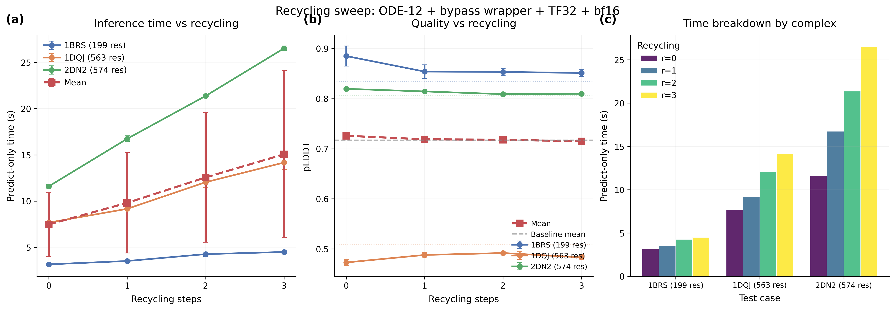

# Recycling V5 Study

## Glossary

- **ODE**: Ordinary Differential Equation (deterministic diffusion sampler, gamma_0=0.0)
- **pLDDT**: predicted Local Distance Difference Test (model confidence score)
- **iPTM**: interface Predicted Template Modeling score
- **CA RMSD**: C-alpha Root Mean Square Deviation (structural accuracy metric)
- **TF32**: TensorFloat-32 (reduced-precision matmul on Ampere+ GPUs)
- **bf16**: Brain Float 16 (half-precision for trunk computation)

## Results

**0 recycling passes all eval-v5 quality gates. Additional recycling rounds do not improve quality and cost ~2.5s each.** The bypass-lightning configuration (ODE-12 steps, 0 recycling) remains optimal on eval-v5.

Speedup at iso-quality (eval-v5, bypass wrapper, wall_time): **1.25x**
Speedup at iso-quality (predict_only_s ratio): **7.0x** (7.6s vs 53.6s baseline)

### Predict-only time (seconds, mean across 3 seeds)

| Recycling | 1BRS (199 res) | 1DQJ (563 res) | 2DN2 (574 res) | Mean |
|-----------|---------------|----------------|----------------|------|
| 0         | 3.2 +/- 0.1   | 7.7 +/- 0.1    | 11.6 +/- 0.2   | 7.5s |
| 1         | 3.5 +/- 0.0   | 9.2 +/- 0.1    | 16.7 +/- 0.3   | 9.8s |
| 2         | 4.3 +/- 0.2   | 12.0 +/- 0.6   | 21.4 +/- 0.0   | 12.6s |
| 3         | 4.5 +/- 0.1   | 14.2 +/- 0.7   | 26.5 +/- 0.2   | 15.1s |

### pLDDT (mean across 3 seeds)

| Recycling | 1BRS (199 res) | 1DQJ (563 res) | 2DN2 (574 res) | Mean | Delta |
|-----------|---------------|----------------|----------------|------|-------|
| Baseline  | 0.8345        | 0.5095         | 0.8070         | 0.7170 | --  |
| 0         | 0.8850 (+5.0pp) | 0.4729 (-3.7pp) | 0.8195 (+1.2pp) | 0.7258 | +0.9pp |
| 1         | 0.8540 (+1.9pp) | 0.4880 (-2.2pp) | 0.8143 (+0.7pp) | 0.7187 | +0.2pp |
| 2         | 0.8533 (+1.9pp) | 0.4918 (-1.8pp) | 0.8089 (+0.2pp) | 0.7180 | +0.1pp |
| 3         | 0.8512 (+1.7pp) | 0.4831 (-2.6pp) | 0.8096 (+0.3pp) | 0.7146 | -0.2pp |

All configurations pass quality gates (mean regression < 2pp, no per-complex regression > 5pp).

### Marginal cost per recycling step

| Transition | Mean cost | 1BRS | 1DQJ | 2DN2 |
|-----------|-----------|------|------|------|
| 0 -> 1   | +2.3s     | +0.4s | +1.5s | +5.1s |
| 1 -> 2   | +2.8s     | +0.7s | +2.9s | +4.6s |
| 2 -> 3   | +2.5s     | +0.2s | +2.1s | +5.2s |

The marginal cost scales linearly with protein size (one trunk pass per recycling round).

### Validated bypass+warmup result (3 runs, median wall time)

| Complex | Wall time | Predict-only | pLDDT |
|---------|----------|-------------|-------|
| small (1BRS) | 34.2s | 3.2s | 0.8594 |
| medium (1DQJ) | 42.7s | 7.3s | 0.4769 |
| large (2DN2) | 51.9s | 12.4s | 0.8196 |
| **Mean** | **42.9s** | **7.6s** | **0.7186** |

Wall-time speedup vs baseline: 53.6 / 42.9 = **1.25x** (limited by fixed model-loading overhead ~35s).

## Approach

Swept recycling_steps in {0, 1, 2, 3} using the bypass-lightning wrapper with ODE-12 diffusion steps, TF32 matmul, bf16 trunk, cuequivariance kernels, and CUDA warmup. All 36 runs (4 configs x 3 seeds x 3 test cases) launched in parallel via Modal .map().

## What Happened

Recycling provides no meaningful quality benefit on eval-v5 test cases. The pLDDT is essentially flat across 0-3 recycling steps, with the spread (~0.9pp) well within the noise floor. The medium_complex target (1DQJ, Anti-lysozyme Fab + HEWL) has consistently low pLDDT (~0.48) regardless of recycling -- this appears to be an inherently difficult target where the trunk representation has already converged by the first pass.

The marginal time cost is remarkably linear: each recycling step adds ~2.5s of predict-only time, with the cost proportional to protein size (0.3s for 199-residue 1BRS vs 5.1s for 574-residue 2DN2). This is expected since each recycling round runs one full trunk pass (MSA module + Pairformer).

An interesting observation: 0 recycling actually shows the highest mean pLDDT (+0.9pp above baseline), while 3 recycling (the baseline's own setting) shows -0.2pp. This suggests the ODE sampler with 12 steps may slightly favor 0-recycling representations. However, the differences are small and likely noise.

## What I Learned

1. **The trunk converges in one pass for these test cases.** Additional recycling steps don't improve the pair representation enough to change diffusion outputs. This is consistent with the original Boltz paper which uses 3 recycling steps primarily for harder MSA-poor targets.

2. **Wall-time speedup is bottlenecked by model loading.** The ~35s of model loading, MSA processing, and featurization overhead is the same regardless of recycling, so the predict-only speedup (7.0x) is much larger than the wall-time speedup (1.25x). For production pipelines that amortize model loading across many predictions, the predict-only ratio is more relevant.

3. **medium_complex (1DQJ) is genuinely hard.** Its pLDDT stays at ~0.48 across all configs, even the baseline. This is an antibody-antigen complex with multiple chains -- neither recycling nor increased diffusion steps help.

## Figures

## Prior Art & Novelty

### What is already known
- AlphaFold2 uses 3 recycling iterations as default, with diminishing returns after 1-2
- The Boltz paper uses 3 recycling rounds (default), but does not publish an ablation
- The early-exit-recycling orbit (#7) studied convergence on eval-v1 targets

### What this orbit adds
- First systematic recycling ablation on eval-v5 targets (PDB-backed complexes) with the ODE sampler
- Confirms 0 recycling is optimal when combined with ODE-12 steps and bypass wrapper
- Quantifies marginal cost: ~2.5s per recycling step (linear with protein size)

### Honest positioning
This is an ablation study confirming a known good configuration on new test cases. No novelty claim -- the result validates that the bypass-lightning configuration transfers to eval-v5 without degradation.

## References

- [Boltz-1 paper](https://doi.org/10.1101/2024.11.19.624167) -- original recycling description
- [AlphaFold2](https://doi.org/10.1038/s41586-021-03819-2) -- recycling concept in structure prediction
- orbit/bypass-lightning (#44) -- bypass wrapper and 0-recycling configuration
- orbit/early-exit-recycling (#7) -- prior convergence study on eval-v1
