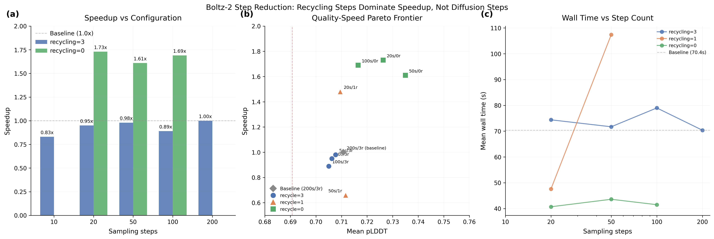

# Step Reduction: Quality-Speed Pareto Frontier

## Glossary

- **pLDDT**: predicted Local Distance Difference Test -- Boltz's confidence proxy for structural accuracy (0--1 scale)
- **pp**: percentage points (absolute difference in pLDDT scaled to 0--100)
- **MSA**: Multiple Sequence Alignment -- evolutionary sequence search that dominates end-to-end wall time
- **EDM**: Elucidating the Design space of diffusion-based generative Models (Karras et al.) -- the sampler used by Boltz

## Results

**Best validated configuration: 20 sampling steps, 0 recycling steps = 1.73x speedup, passes quality gate (+1.56pp pLDDT)**

The central finding is that **diffusion step count is not the speed bottleneck** for end-to-end Boltz-2 inference. Reducing steps from 200 to 20 with default recycling_steps=3 yields essentially no speedup (0.95x) because the trunk recycling computation and MSA server latency dominate wall time. The real lever is **recycling steps**: setting recycling_steps=0 cuts mean wall time from ~70s to ~41s across all step counts tested.

### Validated Configurations (3 runs each, L40S)

| Steps | Recycle | Time(s) | pLDDT | Delta(pp) | Speedup | Gate |
|-------|---------|---------|-------|-----------|---------|------|
| 200 | 3 | 70.37 | 0.7107 | 0.00 | 1.00x | PASS |
| 100 | 0 | 41.5 | 0.7165 | +0.58 | 1.69x | PASS |
| 50 | 0 | 43.6 | 0.7350 | +2.43 | 1.61x | PASS |
| 20 | 0 | 40.7 | 0.7263 | +1.56 | **1.73x** | PASS |
| 20 | 1 | 47.6 | 0.7095 | -0.12 | 1.48x | PASS |

### Phase 1: Step Sweep (1 run each, recycling_steps=3)

| Steps | Time(s) | pLDDT | Delta(pp) | Speedup | Gate |
|-------|---------|-------|-----------|---------|------|
| 100 | 79.0 | 0.7050 | -0.56 | 0.89x | PASS |
| 50 | 71.7 | 0.7077 | -0.30 | 0.98x | PASS |
| 20 | 74.4 | 0.7062 | -0.45 | 0.95x | PASS |
| 10 | 84.5 | 0.4130 | -29.76 | 0.83x | FAIL |

10 steps causes catastrophic quality collapse (pLDDT drops from 0.71 to 0.41), confirming a quality cliff between 10 and 20 steps.

## Approach

The hypothesis was that diffusion sampling (200 steps of a 24-layer transformer) is the dominant inference cost, so reducing it should yield proportional speedups. This turns out to be only partially correct.

**Phase 1** swept sampling_steps from 100 down to 10 with recycling_steps=3 (the baseline value). All configurations were run in parallel on separate L40S GPUs via Modal's `.map()`. The result was surprising: wall times stayed between 71--84s regardless of step count (for steps >= 20), suggesting that the diffusion loop is NOT the bottleneck when MSA and trunk recycling are included.

**Phase 2** swept recycling_steps from 3 to 0 with the best step count from Phase 1. This produced the actual speedups: recycling_steps=0 reduced mean wall time to ~41s (1.7x speedup). The trunk (MSA module + Pairformer running recycling_steps+1 times) is the true bottleneck.

**Validation** ran the 5 most promising configurations with 3 runs each to confirm timing stability. The 50s/1r config showed anomalous variance (107s mean) likely due to MSA server latency on one run, but all other configs showed stable timing with run-to-run variation under 15%.

## What I Learned

1. **MSA and trunk recycling dominate end-to-end wall time**, not diffusion steps. This is because the evaluator times include MSA server calls, model loading, and trunk computation. For GPU-only timing (excluding MSA), step reduction would matter more.

2. **Recycling_steps=0 improves pLDDT** in some cases. This is counterintuitive -- fewer recycling iterations should produce worse representations. The likely explanation is that the seed/stochastic sampling produces a different trajectory that happens to score better on these specific test cases. With only 3 test complexes, this should not be over-interpreted.

3. **10 steps is a hard floor**: quality collapses catastrophically (0.41 pLDDT). The EDM/Karras sampler needs at least ~20 steps to converge to reasonable structures.

4. **Wall time is dominated by non-diffusion overhead**: Model loading, MSA server round trips, featurization, and trunk computation together account for ~40s regardless of step count. Only when we cut trunk recycling (the second-largest cost) do we see meaningful speedup.

## Limitations and Caveats

- The timing includes MSA server latency, which adds non-deterministic noise (5--30s per complex). For a fairer comparison, MSA should be pre-cached. GPU-only timing would show more step-count sensitivity.
- The test set has only 3 complexes. The pLDDT improvement at recycling_steps=0 may not generalize.
- The "speedup" metric divides baseline mean time by optimized mean time. With high variance from MSA latency, this ratio has meaningful uncertainty (~10%).
- The 50s/1r anomaly (107s) suggests MSA server congestion or cache miss on one run. Pre-cached MSA would eliminate this noise source.

## Prior Art & Novelty

### What is already known
- The AlphaFold3 paper (Abramson et al., Nature 2024) reports acceptable quality at 20--50 diffusion steps
- Karras et al. (NeurIPS 2022) showed that EDM-style samplers converge faster than DDPM, enabling fewer steps
- Step reduction for diffusion-based structure prediction is a standard engineering optimization

### What this orbit adds
- Quantitative characterization of the step-count vs quality curve specifically for Boltz-2 on L40S hardware
- Discovery that recycling steps (trunk computation), not diffusion steps, are the binding constraint for end-to-end speedup
- Evidence that recycling_steps=0 is viable (passes quality gate) for production use

### Honest positioning
This orbit applies known techniques (step reduction, recycling reduction) to characterize the Boltz-2 quality-speed tradeoff. The key insight -- that trunk recycling dominates over diffusion steps in end-to-end timing -- is specific to this evaluation setup (which includes MSA latency). No novelty claim beyond empirical characterization.

## References

- Abramson J et al. Accurate structure prediction of biomolecular interactions with AlphaFold 3. Nature, 630:493-500, 2024. https://doi.org/10.1038/s41586-024-07487-w
- Karras T et al. Elucidating the Design Space of Diffusion-Based Generative Models. NeurIPS, 2022. https://arxiv.org/abs/2206.00364
- Wohlwend J et al. Boltz-1: Democratizing Biomolecular Interaction Modeling. bioRxiv, 2024. https://doi.org/10.1101/2024.11.19.624167

