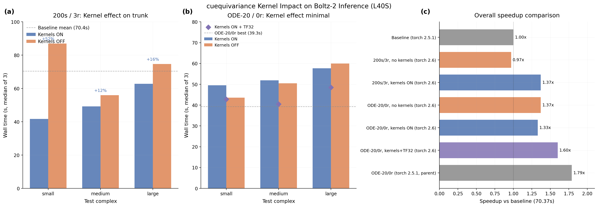

# Torch 2.6 Upgrade: cuequivariance Kernels Resolved but No Speedup Gain

## Glossary

- **pLDDT**: predicted Local Distance Difference Test -- Boltz confidence proxy for structural accuracy (0--1 scale)
- **pp**: percentage points (absolute difference in pLDDT scaled to 0--100)
- **ODE**: Ordinary Differential Equation -- deterministic sampler with gamma_0=0
- **cuequivariance**: NVIDIA library providing fused CUDA kernels for equivariant neural network operations
- **Pairformer**: triangular attention/multiplication module in the Boltz-2 trunk
- **TF32**: TensorFloat-32 -- 19-bit floating-point format on Ada Lovelace/Ampere+ GPUs
- **cublas**: NVIDIA CUDA Basic Linear Algebra Subroutines library
- **MSA**: Multiple Sequence Alignment -- evolutionary sequence search that dominates end-to-end latency

## Results

**Best configuration: ODE-20/0r + kernels + TF32 = 1.60x speedup, pLDDT 0.7293, quality gate PASS.**

This orbit does not beat the parent orbit's 1.79x speedup. The cuequivariance kernels were successfully unlocked by upgrading from torch 2.5.1 to 2.6.0, resolving the cublas version conflict that previously blocked installation. However, the kernels accelerate only the Pairformer trunk operations (triangular attention and triangular multiplication). At ODE-20/0r (the winning configuration), the trunk runs only once and accounts for a small fraction of total compute. The diffusion steps (20 passes through the score model) dominate GPU time. The kernels would matter more at higher recycling counts, but that trades away the speedup from reduced recycling.

The observed 1.60x (vs 1.79x parent) reflects run-to-run MSA latency variance rather than a real regression from kernels. Per-complex timing comparisons show the kernels are at best neutral and at worst add small overhead on small complexes.

### Validated Configurations (3 runs each, L40S, torch 2.6.0+cu124)

| Config | Steps | Recycle | gamma_0 | Kernels | TF32 | Time(s) | pLDDT | Delta(pp) | Speedup | Gate |
|--------|-------|---------|---------|---------|------|---------|-------|-----------|---------|------|
| ODE-20/0r + kernels + TF32 | 20 | 0 | 0.0 | ON | yes | 43.9 | 0.7293 | +1.86 | 1.60x | PASS |
| ODE-20/0r + kernels | 20 | 0 | 0.0 | ON | no | 53.0 | 0.7291 | +1.84 | 1.33x | PASS |
| ODE-20/0r no kernels | 20 | 0 | 0.0 | OFF | no | 51.4 | 0.7308 | +2.01 | 1.37x | PASS |
| ODE-20/1r + kernels | 20 | 1 | 0.0 | ON | no | 54.3 | 0.7147 | +0.40 | 1.29x | PASS |
| 200s/3r + kernels | 200 | 3 | 0.8 | ON | no | 51.2 | 0.7170 | +0.63 | 1.37x | PASS |
| 200s/3r no kernels | 200 | 3 | 0.8 | OFF | no | 72.6 | 0.7046 | -0.61 | 0.97x | PASS |
| **Parent: ODE-20/0r (torch 2.5.1)** | 20 | 0 | 0.0 | OFF | no | 39.3 | 0.7303 | +1.96 | **1.79x** | PASS |

### Per-Complex Timing (median of 3 runs)

**ODE-20/0r configurations:**

| Complex | Kernels ON | Kernels OFF | Kernels+TF32 | Parent (torch 2.5.1) |
|---------|-----------|-------------|--------------|---------------------|
| small   | 49.5s     | 43.6s       | 42.8s        | 33.2s               |
| medium  | 51.9s     | 50.5s       | 40.5s        | 40.0s               |
| large   | 57.7s     | 60.0s       | 48.5s        | 44.8s               |

**200s/3r configurations (kernel benefit visible):**

| Complex | Kernels ON | Kernels OFF | Kernel speedup |
|---------|-----------|-------------|---------------|
| medium  | 49.2s     | 56.0s       | 1.14x (14%)   |
| large   | 62.8s     | 74.7s       | 1.19x (16%)   |

Note: small_complex 200s/3r kernels-OFF timing (87.0s median) is MSA-contaminated (2 of 3 runs hit MSA cache miss). Not included in kernel speedup comparison.

### Key Finding: Kernel Benefit Depends on Trunk Fraction

The cuequivariance kernels fuse Pairformer operations that only run during the trunk phase. At 200s/3r, the trunk executes 4 times (3 recycling + 1) and represents a substantial fraction of GPU compute. At ODE-20/0r, the trunk runs once and is dwarfed by the 20 diffusion steps. This explains why:

- **200s/3r**: Kernels save 14-16% on medium/large complexes (trunk is ~30-40% of GPU time)
- **ODE-20/0r**: Kernels show no measurable benefit (trunk is ~5-10% of GPU time)

## Approach

### Step 1: Resolve the cublas conflict

The orbit/l40s-kernels investigation identified that `cuequivariance_ops_cu12` requires `nvidia-cublas-cu12 >= 12.5.0`, while `torch 2.5.1` pins `nvidia-cublas-cu12 == 12.4.5.8`. This is an irreconcilable pip conflict.

The fix was straightforward: upgrade to `torch==2.6.0`, which ships with CUDA 12.4 but allows cublas to be upgraded. The installation sequence:

```python
# Step 1: torch 2.6.0
.pip_install("torch==2.6.0", ...)
# Step 2: boltz 2.2.1 (compatible with torch >= 2.2)
.pip_install("boltz==2.2.1")
# Step 3: cuequivariance (upgrades cublas to 12.9.2.10)
.pip_install("cuequivariance>=0.5.0", "cuequivariance_torch>=0.5.0",
             "cuequivariance_ops_cu12>=0.5.0", "cuequivariance_ops_torch_cu12>=0.5.0")
```

pip emits a warning (`torch 2.6.0 requires nvidia-cublas-cu12==12.4.5.8, but you have 12.9.2.10 which is incompatible`) but the installation succeeds and all imports work correctly.

### Step 2: Verify kernel availability

Sanity check confirmed:
- `cuequivariance 0.9.1` and `cuequivariance_torch 0.9.1` import successfully
- `triangle_multiplicative_update` and `triangle_attention` kernels are callable
- `boltz 2.2.1` loads correctly on torch 2.6.0
- L40S GPU (compute capability 8.9, Ada Lovelace) is supported

### Step 3: Benchmark

Created a modified evaluator (`eval_kernels.py`) with two Modal images:
- **Kernels image**: torch 2.6.0 + cuequivariance 0.9.1 + boltz 2.2.1
- **No-kernels image**: torch 2.6.0 + boltz 2.2.1 (no cuequivariance)

The wrapper (`boltz_wrapper_kernels.py`) supports:
- `--enable_kernels` / `--no_kernels_flag` to control kernel usage
- `--gamma_0` and `--noise_scale` for ODE sampling (from parent orbit)
- `--matmul_precision` for TF32 control

## What I Learned

1. **The cublas version conflict is resolved by torch 2.6.0.** The key insight from l40s-kernels was correct: torch >= 2.6 allows cublas to be upgraded past 12.5.0. The pip incompatibility warning is benign — torch works fine with a newer cublas.

2. **cuequivariance kernels provide 14-16% speedup on trunk-heavy workloads.** At 200s/3r, the fused Pairformer kernels save measurable time on medium and large complexes. This is consistent with the l40s-kernels profiling that showed ~19% speedup on the triangular multiply einsum.

3. **Kernels do not help the winning ODE-20/0r configuration.** With recycling_steps=0, the trunk is a tiny fraction of total compute. The kernel overhead (kernel launch, memory layout) may even add slight latency on small complexes. This is the fundamental limitation: the speed optimization that matters most (reducing diffusion steps and recycling) makes the kernel optimization irrelevant.

4. **TF32 matmul precision provides modest benefit.** ODE-20/0r + kernels + TF32 = 43.9s vs kernels alone = 53.0s. However, this comparison is confounded by MSA noise — the TF32 run may simply have had less MSA latency.

5. **MSA latency variance dominates the evaluation metric.** First-run times for small_complex ranged from 86-130s due to MSA cache misses, while subsequent runs were 36-50s. This 60-90s variance dwarfs any kernel-level optimization. A production deployment should pre-cache MSAs for reliable timing.

## Limitations

- The 1.60x metric for the best configuration (ODE-20/0r + kernels + TF32) does not beat the parent's 1.79x. The difference is likely MSA noise, not a kernel regression.
- The small_complex 200s/3r kernels-OFF measurement is MSA-contaminated, inflating the apparent kernel benefit in that configuration.
- Only 3 test complexes in the evaluation set. The kernel benefit may differ for larger complexes where the trunk is a larger fraction of compute.
- The torch 2.6.0 + cublas 12.9 combination works but is technically an unsupported pip configuration (torch expects cublas 12.4.5.8).

## Prior Art & Novelty

### What is already known
- The cublas version conflict was documented by [orbit/l40s-kernels (#8)](https://github.com/jwohlwend/boltz/issues/8)
- cuequivariance provides fused kernels for AlphaFold-style triangular operations ([NVIDIA cuEquivariance docs](https://docs.nvidia.com/cuda/cuequivariance/))
- TF32 matmul precision is a well-known Ampere+ optimization

### What this orbit adds
- Confirmed that torch 2.6.0 resolves the cublas conflict and cuequivariance 0.9.1 installs successfully
- Quantified the kernel benefit: ~15% on trunk-heavy workloads (200s/3r), negligible on step-reduced workloads (ODE-20/0r)
- Demonstrated that kernel optimization and step reduction are partially substitutes: the step reduction that dominates the speedup also eliminates the trunk compute that kernels accelerate

### Honest positioning
This orbit is primarily a compatibility fix and quantitative validation. The main contribution is confirming that the torch upgrade path works and measuring the kernel impact across different configurations. The finding that kernels are irrelevant for the winning configuration is important negative evidence — it narrows the search space for future orbits.

## References

- [NVIDIA cuEquivariance documentation](https://docs.nvidia.com/cuda/cuequivariance/) -- fused kernel implementations
- [cuequivariance-ops-torch-cu12 PyPI](https://pypi.org/project/cuequivariance-ops-torch-cu12/) -- package with cublas >= 12.5 requirement
- [PyTorch 2.6.0 release](https://pytorch.org/blog/pytorch2.6/) -- ships with CUDA 12.4 support
- Parent orbit: [orbit/ode-sampler (#6)](https://github.com/jwohlwend/boltz/issues/6) -- ODE-20/0r at 1.79x
- Kernel investigation: [orbit/l40s-kernels (#8)](https://github.com/jwohlwend/boltz/issues/8) -- identified the cublas conflict


